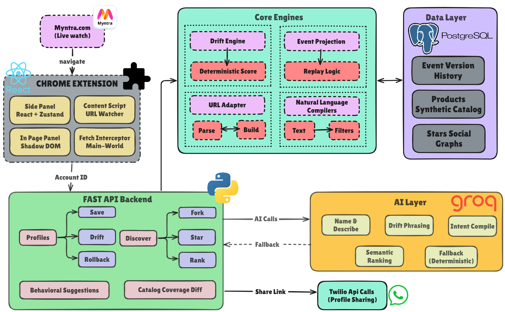

# 🧾 Shelfie

**A notebook clipped to your Myntra browser tab — so your filters remember you, instead of the other way around.**

[](https://fastapi.tiangolo.com/)
[](https://react.dev/)
[](https://www.typescriptlang.org/)
[](https://www.postgresql.org/)
[](https://developer.chrome.com/docs/extensions/mv3/intro/)
[](https://groq.com/)
[](#-hackathon-context)

---

## The Pitch

Every time you shop on Myntra, you start from zero. Same brand, same size, same fabric, same price range you filtered for last week — rebuilt by hand, from scratch, every single visit. If you're shopping for more than one person on a shared family account, multiply that by however many people share the login. Shelfie is a Chrome extension that watches the filters you already build on Myntra and turns them into a **Shopping Profile**: a named, versioned, shareable object that remembers what you searched for, knows when it's changed enough to be a *different* search, and can be handed to someone else with one tap. It's less a shopping tool bolted onto Myntra and more a notebook clipped to the browser tab you're already using.

---

## The Problem

Myntra's filters are powerful but **ephemeral** — closing the tab throws them away. That's fine for a single, one-off search. It breaks down the moment shopping becomes a recurring or shared activity:

- **Repeat searches get rebuilt from scratch.** "Black cotton kurtas under ₹1500" from last month isn't saved anywhere the platform understands — you either remember the exact filter combination or start over.
- **Wishlists save products, not the *search* that found them.** They don't capture the brand/size/fabric/price logic that produced the list, so they can't be reused for the next round of shopping.
- **Shared family accounts flatten everyone into one shopping identity.** A parent shopping for two kids and themselves on the same login has no way to keep those three shopping intents separate, let alone versioned or handed off.
- **There's no way to tell a minor filter tweak from a genuinely new search.** Every change is just... a new URL. Nothing distinguishes "I nudged the price cap" from "I'm shopping for a completely different occasion now."

None of this is a data problem Myntra is missing — it's a *memory* problem. Shelfie's bet is that shopping filters deserve the same treatment as any other evolving artifact: named, versioned, and shareable.

## The Solution

Shelfie sits between you and the Myntra tab you're already on. It watches the live URL, turns it into a structured, typed filter object, and lets you:

- **Save a search as a named Shopping Profile** under a persona (e.g. "Amma", "Kid"), and reopen it later to instantly re-navigate Myntra back to the exact same filtered view.
- **Get a deterministic, explainable recommendation** — never an AI guess — on whether a filter change is a minor tweak (update in place), a meaningful evolution (new version, full history kept), or a different search entirely (new profile).
- **Roll back to any past version** via a real event replay, not a decremented counter.
- **Publish, discover, star, and fork** other people's public profiles — turning individual shopping intents into a small, browsable social graph.
- **Type a sentence instead of clicking filters** ("pure cotton kurtas under 1500 for school") and have it compiled into validated, applied filters — never a guess past what a small hand-maintained vocabulary can confidently map.
- **Share a saved profile over WhatsApp** with an AI-written one-line description and a working Myntra link, without leaving the extension.

Every one of these is real, tested, working software — no mocked data, no hardcoded demo state, and no AI call in the whole system without a deterministic fallback if the model is unavailable.

---

## 🏗️ Architecture

<!-- Architecture diagram goes here — do not remove this placeholder -->
<p align="center">
  
</p>


Shelfie's browser side is five separate build outputs — a side panel, a background service worker, an isolated-world content script, an isolated-world in-page panel, and a MAIN-world interceptor — all talking to a single FastAPI backend over HTTPS. The backend persists everything as an append-only event log in Postgres, calls Groq for every AI touchpoint (each with a deterministic fallback), and reaches Twilio for outbound WhatsApp sharing.

---

## ✨ Key Features

### Core: Save, Version, Roll Back
- **Live filter capture** — the content script watches Myntra's URL (SPA navigation and full reloads alike) and parses it into a structured `Constraints` object covering category, price, brand, fabric, color, size, sleeve, neck, occasion, and a catch-all for anything not explicitly modeled.
- **Deterministic drift detection** — a weighted-distance engine (never an AI black box) scores how far live filters have drifted from a saved profile and recommends *update in place*, *new version*, or *new profile*, with a human-readable reason.
- **Real version history** — every commit is an event; `Timeline` renders the full history with working per-version rollback, and rollback is a genuine replay of past events, not a counter decrement.
- **Dry-run diffs & coverage advice** — preview "+N added / −M removed" against a labeled synthetic catalog before committing, and get relaxation suggestions when a filter combination is too narrow to return results.

### Collaboration
- **Publish, Discover, Star, Fork** — toggle a profile public, browse everyone's public profiles ranked by a time-decayed star score, star with an idempotent toggle, and fork someone else's profile into your own persona without ever touching their event log.
- **Personas** — separate shopping identities on one shared account/login, each with its own profiles and its own "never show me" global exclusions.
- **One-tap WhatsApp sharing** — share any profile you own (or any public one you've found) with an AI-written description and a working Myntra link, via a raw Twilio REST integration.

### AI (Groq, always with a deterministic fallback)
- **Natural-language → filters compiler** — describe what you want in a sentence; a propose-then-validate pipeline maps it against a hand-maintained lexicon and applies only what it can confidently validate.
- **Semantic Discover search** — an instant offline client-side ranking, upgraded in place by a genuine Groq-powered semantic re-rank once it resolves.
- **AI-phrased drift reasons & profile names/descriptions** — the *math* behind drift, ranking, and coverage is always deterministic; AI only ever touches the wording.

### Advisory
- **Behavioural suggestions (opt-in)** — after repeatedly searching the same settled filter combination, Shelfie nudges you to save it as a profile — suppressed automatically if you've essentially already saved it.
- **The in-page Discover panel's zero-result self-healing retry system** — not something in the original pitch, but one of the more technically interesting pieces shipped: a MAIN-world script intercepts Myntra's own search-gateway calls to detect a zero-result page (or, for pages that 404 before reaching the gateway, falls back to a DOM-based empty-state check), then automatically drops the least-confident filter and retries — up to 5 times — so an AI-compiled or forked filter combination that hits a facet value Myntra doesn't recognize quietly repairs itself instead of leaving you on a dead page.

---

## How It Works

1. **Browse and filter, normally.** Open Myntra, build a filter search the way you always would — no Shelfie-specific UI required to get started.
2. **Shelfie notices.** The side panel (or the floating in-page button) shows your live filters as a structured profile in progress, and picks a persona if you've set one up.
3. **Save it.** Name the profile and commit it. From then on, reopening it re-navigates Myntra straight back to that exact filtered view.
4. **Keep shopping — Shelfie tells you what changed.** Tweak a filter later and Shelfie scores the drift, recommending update, new version, or new profile, with a plain-language reason.
5. **Share or discover.** Publish a profile, browse what others have made public, star the useful ones, fork a profile that's close to what you want, or send it straight to someone over WhatsApp.
6. **Come back anytime.** Every version is preserved. Roll back, branch off, or just reopen last month's saved search — it's exactly as you left it.

---

## Tech Stack

| Layer | Technology | Notes |
|---|---|---|
| Backend framework | FastAPI 0.115.6 + Uvicorn 0.32.1 | Single process, no auth system |
| ORM / DB driver | SQLAlchemy 2.0.36 + psycopg[binary] 3.2.3 | |
| Database | PostgreSQL 16-alpine (Docker) | Event store; host port **5433** (a native Postgres on 5432 would otherwise intercept the connection) |
| Validation | Pydantic 2.10.3 | Every request/response shape |
| HTTP client | httpx 0.27.2 | Used for **both** the internal test client **and** raw REST calls to Twilio — there is no `twilio` SDK dependency; WhatsApp sending is hand-rolled HTTP Basic Auth against Twilio's Messages API |
| AI | Groq (4-key round-robin client) | Every AI touchpoint has a non-AI deterministic fallback |
| Testing | pytest 8.3.4 + pytest-asyncio 0.24.0 | |
| Extension framework | Chrome Manifest V3 | 5 separate build outputs from one source tree |
| Frontend | React 19.2 + TypeScript ~6.0 | Two independent Zustand 5.0 stores, zero shared runtime state |
| Build | Vite 8.1 (two separate configs — one for the real ES-module side panel, one for four classic-script content-script builds) | |
| Styling | Tailwind CSS 4.3 (`@tailwindcss/vite`) | Injected into a Shadow DOM for the in-page panel |
| Linting | oxlint 1.71 | |

---

## Project Structure

```
Shelfie/
├── docs/                              Living documentation
│   ├── SHELFIE_MASTER_DOCUMENTATION.md   Full architecture reference (16 sections)
│   ├── BACKEND_BUILD_LOG.md              Chronological backend build diary
│   └── FRONTEND_CHANGES_LOG.md           Chronological frontend build diary
│
├── backend/
│   ├── docker-compose.yml             Postgres 16-alpine, host port 5433
│   ├── requirements.txt
│   ├── scripts/seed_catalog.py        Generates 6,000 synthetic Product rows
│   └── app/
│       ├── main.py                    FastAPI app, CORS, router wiring, /health
│       ├── models.py / schemas.py     ORM models & Pydantic shapes
│       ├── projection.py              Event fold/replay — single source of truth
│       ├── drift.py                   Deterministic drift-scoring engine
│       ├── ai/                        Groq client + 5 AI touchpoints
│       ├── integrations/twilio_client.py   Raw httpx WhatsApp sender
│       └── routers/                   personas, profiles, discover, behaviour, catalog, ai
│
├── extension/
│   ├── manifest.json                  MV3 manifest — 3 content scripts + side panel
│   ├── package.json                   5-bundle build pipeline
│   └── src/
│       ├── main.tsx / App.tsx         Side panel React root
│       ├── background.ts              Service worker
│       ├── content-script.ts          Isolated-world URL watcher + navigator
│       ├── main-world-interceptor.ts  MAIN-world fetch/XHR patch
│       ├── inpage-panel.ts            In-page panel entry point
│       ├── panel/                     Side-panel-only components
│       ├── inpage/                    In-page-panel-only components + retry logic
│       ├── components/ShareButton.tsx Shared across both bundles
│       ├── store/                     Side panel's Zustand store
│       ├── adapter/                   Pure logic shared by every bundle (URL parsing, merge, navigate, similarity)
│       └── api/                       Backend client + types
│
└── README.md
```

Full annotated structure, including every file, is in [`docs/SHELFIE_MASTER_DOCUMENTATION.md` § 3](docs/SHELFIE_MASTER_DOCUMENTATION.md#3-repository--folder-structure).

---

## Getting Started

### Prerequisites

- [Docker Desktop](https://www.docker.com/products/docker-desktop/) (for Postgres)
- Python 3.11+ and Node.js 18+
- Google Chrome
- A [Groq](https://console.groq.com/) API key (at least one; the client supports up to 4 for round-robin), and Twilio credentials if you want WhatsApp sharing to actually send

### Quick start (Windows)

The fastest path is the included one-shot launcher, which brings up Postgres, sets up the backend venv, seeds the catalog, starts the backend in its own terminal window, and builds the extension:

```powershell
.\start.bat
```

When it finishes, the backend is live at `http://localhost:8000` and the extension is built to `extension\dist`, ready to load into Chrome (see [Loading the extension](#loading-the-extension) below).

### Manual setup

```powershell
# Backend
cd backend
docker compose up -d db              # Postgres 16-alpine on host port 5433
python -m venv .venv                 # first time only
.venv\Scripts\pip install -r requirements.txt
.venv\Scripts\python -m uvicorn app.main:app --port 8000
                                      # do NOT use --reload — restart manually after any edit
.venv\Scripts\python -m scripts.seed_catalog   # (re)seed the synthetic product catalog

# Frontend (separate terminal)
cd extension
npm install
npm run build                        # produces dist/ with all 5 bundles + manifest.json
```

You'll also need a `backend/.env` with your own Groq API key(s) and Twilio credentials — see `backend/.env.example` for the full list of variables. Without them, the backend still runs; every AI/WhatsApp touchpoint just falls back to its deterministic default instead of calling out.

### Loading the extension

1. Open `chrome://extensions` in Chrome.
2. Enable **Developer mode** (top right).
3. Click **Load unpacked** and select `extension\dist`.
4. Confirm the backend is up by visiting `http://localhost:8000/health` — it should return `{"status":"ok"}`.
5. Go to [myntra.com](https://www.myntra.com) and start filtering a search. The Shelfie icon in the toolbar opens the side panel; a floating button also appears directly on the page for the in-page Discover panel.
6. After any code change: re-run `npm run build` (or `.\start.bat` again), then click the reload icon on the Shelfie card in `chrome://extensions`.

---

## API Overview

All endpoints (except `/health`) require an `X-Account-Id` header; the account row is auto-created on first sight — there is no login system (see the master doc's [Identity Model](docs/SHELFIE_MASTER_DOCUMENTATION.md#5-identity-model--no-login-account-scoped-by-header)).

| Method & Path | Purpose |
|---|---|
| `GET /profiles?personaId=` | List a persona's profiles with live-projected state |
| `POST /profiles/{id}/drift` | Score how far live filters have drifted from a saved profile |
| `POST /profiles/{id}/commit` | Save as update / new version / new profile |
| `POST /profiles/{id}/rollback` | Revert to a past version via real event replay |
| `GET /discover?limit=&offset=` | Time-decayed public profile feed |
| `POST /discover/{id}/fork` | Fork a public profile into your own persona |
| `POST /ai/compile-intent` | Natural language → validated, applied filters |
| `POST /profiles/{id}/share` | Send a profile over WhatsApp via Twilio |

This is a representative slice — the full 20-endpoint reference, with request/response shapes, lives in [`docs/SHELFIE_MASTER_DOCUMENTATION.md` § 11](docs/SHELFIE_MASTER_DOCUMENTATION.md#11-complete-api-reference).

---

## Known Limitations

- **Price filters aren't yet round-tripped into a rebuilt Myntra URL** — Myntra's price/discount URL format was never fully reverse-engineered.
- **No production deployment yet** — CORS is currently permissive for local dev, not pinned to a deployed extension ID.
- **The product catalog behind coverage/diff is synthetic**, not real Myntra inventory — labeled as such everywhere it appears.
- **Global exclusions aren't wired into drift scoring**, only into catalog coverage/diff — a deliberate scope line.
- **No vision-based fallback** for filters the compiler can't otherwise resolve.
- **Twilio WhatsApp sending runs on a sandbox number**, which requires each recipient to opt in via a join code first — a platform constraint, not something the app's code controls.

Full detail in [`docs/SHELFIE_MASTER_DOCUMENTATION.md` § 15](docs/SHELFIE_MASTER_DOCUMENTATION.md#15-known-limitations--explicitly-out-of-scope-items).

---

## 🔮 Roadmap *(not yet built)*

Everything above is shipped and working. Everything below is direction, not status.

**Phase 1 — Intelligent Shopping.** Deeper automatic profile suggestions from browsing patterns, broader filter-vocabulary coverage beyond the current lexicon, and real Myntra inventory in place of the synthetic catalog.

**Phase 2 — Collaborative Commerce.** Richer shared-account tooling — multi-person profile ownership, comment/react on shared profiles, and deeper cross-persona coordination for families shopping together.

**Phase 3 — Shopping Intelligence Platform.** Extending the same versioned-profile idea beyond Myntra, plus a public API for the Discover graph so profiles can be surfaced outside the extension itself.

---

## Why This Matters

Shelfie doesn't invent new shopping data — it gives structure to filter behavior that already happens on every visit and is thrown away every time the tab closes. The four ideas underneath it are what make that structure useful rather than just another "save search" button:

- **Intent drift detection** turns "did I change my search enough to call it new?" from a judgment call into a deterministic, explainable answer.
- **The persona engine** lets one shared login represent several distinct shoppers without flattening them into one blended history.
- **Event-sourced version control** means history is never approximated — rollback is a real replay, not a guess.
- **Community discovery** turns individual filter searches into something that can be starred, forked, and handed to someone else, the way a well-built list already works in other domains.

None of this requires a platform migration or new inventory data — it's a layer on top of filters Myntra already exposes, which is why it's shippable as a browser extension rather than a platform rewrite.

---

## Hackathon Context

Built for **Myntra WeForShe Hackerramp 2026** — *"Build What's Next: Myntra for Bharat,"* Theme 1: **The Bharat Opportunity**.

**Team OFFBYTES** — Khushi Singh · Mayeraa Singh · Mishka Tiwari

Shelfie addresses the theme's call for products that meet Bharat's shoppers where their real behavior already is — shared family accounts, repeat searching, and word-of-mouth discovery — with working software rather than a slide-deck concept.

---

## Further Documentation

- [`docs/SHELFIE_MASTER_DOCUMENTATION.md`](docs/SHELFIE_MASTER_DOCUMENTATION.md) — the full architecture reference: data model, identity model, the drift engine, AI integration layer, every feature deep-dive, the five-bundle frontend architecture, the complete API reference, the Myntra URL adapter, security/CORS config, real bugs found during development, known limitations, and setup instructions.
- [`docs/BACKEND_BUILD_LOG.md`](docs/BACKEND_BUILD_LOG.md) — chronological backend build diary.
- [`docs/FRONTEND_CHANGES_LOG.md`](docs/FRONTEND_CHANGES_LOG.md) — chronological frontend build diary.

---

## License

No license file yet.
