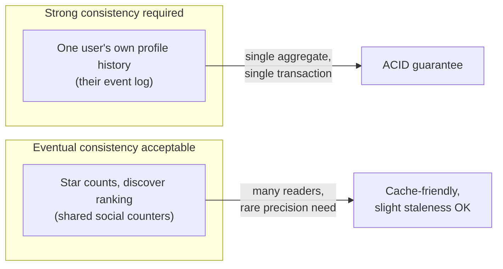
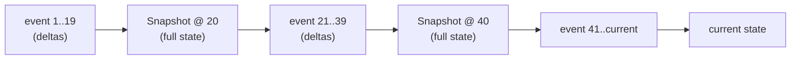

# 00 — Architecture philosophy and consistency model

## The core tension this system resolves

Every application that lets a user "change something" has to answer one question: **do you overwrite the old value, or do you keep it?**

Overwriting (the default in almost every CRUD app) is cheap and simple, but it destroys information. The moment `brand = Aurelia` overwrites `brand = Libas`, there is no way to answer "what did this look like an hour ago?" without a separately bolted-on audit log — and bolted-on audit logs have a structural weakness: **they are not authoritative.** The application's real behavior is driven by the mutable row; the audit log is a side effect that a developer has to remember to write correctly on every code path. It can drift from the truth (a missed log call, a failed transaction that logs anyway, a race condition). It documents history without being able to reconstruct it.

**Event sourcing inverts this.** The log is not a side effect — **it is the only thing that is ever written.** The "current state" is not stored anywhere as a mutable fact; it is *computed* by folding the log. This means the log cannot drift from the truth, because the log *is* the truth. There is nothing else to drift from.

This document explains the consistency, concurrency, and cost trade-offs that follow from that choice, because "we used event sourcing" is not itself an argument — the argument is what it buys you and what it costs, precisely.

---

## Why this problem does not need distributed consensus

A lot of "event sourcing" literature discusses it in the context of distributed systems — Kafka topics, eventually-consistent read replicas, CQRS with a message bus between write and read models. **None of that complexity applies here, and it's worth being explicit about why**, because a judge who knows distributed systems will wonder if you understand the difference.

The key structural fact: **each Shopping Profile has exactly one aggregate root (`profile_id`), and in the overwhelming majority of cases, exactly one writer** (the user themselves, in one browser, editing one profile). This is fundamentally a **single-writer, single-aggregate** system, not a multi-writer distributed one. That has three consequences:

1. **No need for an async message bus.** Because writes to one profile's event log and updates to its projection (read-model cache) happen against the same profile, in the same database, they can be wrapped in **one ACID transaction**. Insert the event, update the projection, commit — atomically. There is no window where the projection is stale relative to the log, unlike Kafka-based event sourcing where a consumer might lag behind the log by milliseconds to seconds. We get strong consistency **for free**, by not distributing the system in the first place.

2. **Concurrency control degrades to optimistic locking, not distributed consensus.** The only concurrency hazard is the same user having two tabs open, or a flaky retry re-sending a request. That's solved with a simple sequence-number check (detailed in `02-event-sourcing-engine.md`) — not Raft, not vector clocks, not CRDTs.

3. **The one place we *do* have multiple actors touching shared data is the social layer** (stars, discover rankings) — and there, we deliberately accept **eventual consistency** as the right trade-off (a star count that's a few seconds stale is fine; a user's own profile history being stale is not). This is a conscious application of the idea that different data in the same system can sit at different points on the consistency spectrum, rather than picking one consistency model for the whole application.

---

## Why we did not reach for Axon / EventStoreDB / Kafka

The "correct" production event-sourcing stack (Axon Framework, EventStoreDB, or a Kafka-backed event bus) exists to solve problems we don't have at this scale: **multi-service consumers of the same event stream, horizontal write-scaling across many aggregates, and replay across service boundaries.** Standing one of those up for a single-team MVP with one write path is not rigor — it's the wrong tool weighed against the actual failure modes we need to guard against.

The engineering judgment being exercised is: **implement the pattern (append-only log, fold-to-derive-state, replay-for-rollback) directly on Postgres, because Postgres already gives us the one guarantee we actually need — transactional atomicity between the log write and the projection update — and doing it ourselves means every line of the mechanism is something we can explain, not a framework black box.** The production migration path (swap the hand-rolled log for EventStoreDB once you have multiple services reading the stream) is a **known, named upgrade**, not a redesign.

---

## Snapshotting: bounding the cost of "state = fold over everything"

The naive event-sourcing cost model is: *reading current state costs O(N)*, where N is the number of events for that aggregate, because you replay from the beginning every time. For a single shopping profile with a few dozen edits over its lifetime, O(N) is trivial (sub-millisecond). But it is worth stating the bound explicitly and the mitigation, because "it just replays everything, forever" is the natural follow-up question from anyone who knows event sourcing.

**Mitigation: periodic snapshotting.** Every *k* commits (we use k = 20), the system writes a special `SnapshotTaken` event whose payload is the **fully computed state at that point**, not a delta. Replaying now means: find the most recent snapshot ≤ target version, then replay only the events *after* it. This bounds replay cost to **O(k)** in the worst case, regardless of how old or how frequently-edited a profile is.

To compute state at version 35: load Snapshot@20 + replay events 21–35 — 15 events, not 35. This is a standard event-sourcing technique and it's what separates "we understand the pattern's cost model" from "we copied the idea without thinking about scale."

---

## Schema evolution: events outlive the code that wrote them

A less obvious but real engineering concern: **the shape of an event's payload will change over the project's life** (e.g., we add a new filter field, `occasion`, three weeks after launch). Old events in the log were written *before* that field existed. If the fold function assumes every `FilterChanged` event has an `occasion` key, replaying an old profile's history will throw.

**Mitigation: every event carries a `schema_version` integer, and the fold function is a versioned dispatch table** — `apply_v1(state, event)`, `apply_v2(state, event)` — so that old events are interpreted with the rules that were true when they were written, and the state they produce is upgraded into the current schema shape at the boundary. This is the same idea as API versioning, applied to your own data instead of your own endpoints.

---

## Summary of the philosophy

| Decision | What it buys | What it costs | Why it's worth it here |
|---|---|---|---|
| Event log as sole source of truth | Full, lossless history; audit-grade correctness | More storage than a mutable row; replay cost | The product's entire value proposition (rollback, fork, transparency) *is* this history |
| Single-aggregate transactional writes | Strong consistency for free, no message bus | Doesn't horizontally scale writes across many services | We have one write path and one team; this is the right scale to be at |
| Eventual consistency for social counters | Cheap, cache-friendly, no contention | Star counts can be briefly stale | Nobody needs their star count to be exact to the millisecond |
| Hand-rolled on Postgres, not Axon/EventStoreDB | Full understanding, zero framework risk in a 3-day build | We wrote ~150 lines a framework would give us | Framework overhead isn't worth it below the scale where you need multi-consumer streams |
| Periodic snapshotting | Bounded replay cost regardless of history length | Slight extra write + storage per snapshot | Without it, "state = fold over everything" is a real, findable weakness |
