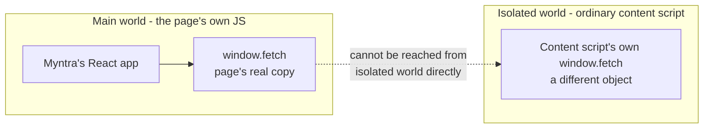
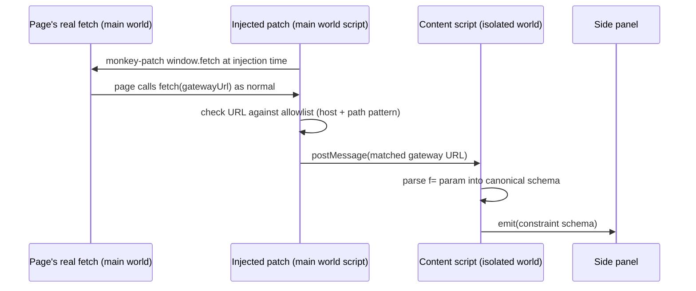
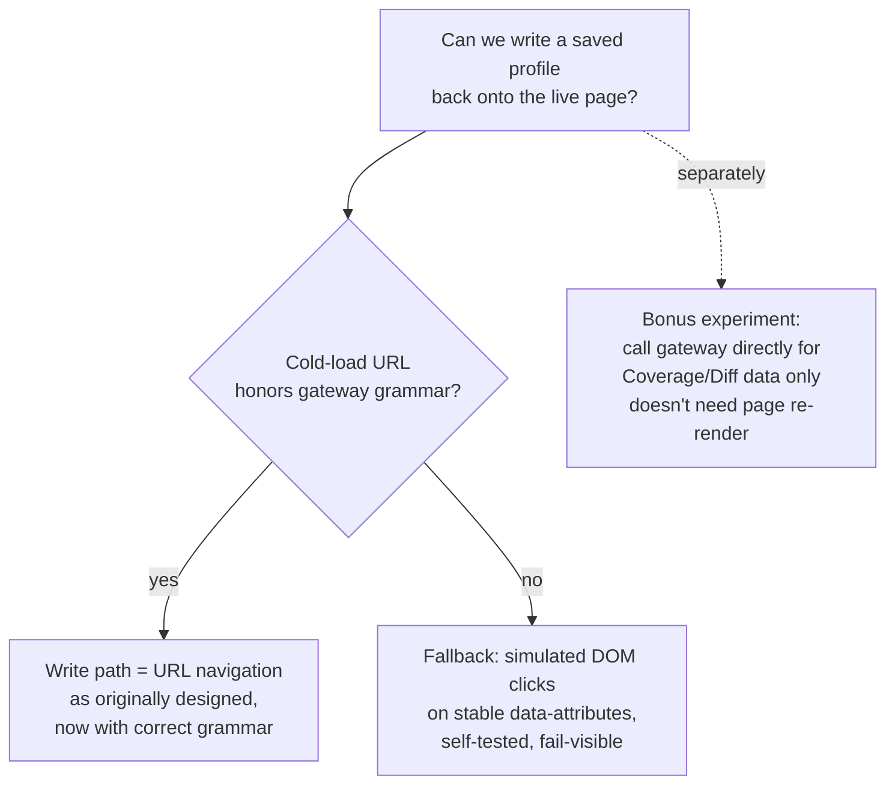

# 01 — The Adapter layer: technical depth (v2 — revised after live-site verification)

> **Revision note**: this file was updated after testing against the real, live Myntra site. The original design assumed the browser address bar was the primary, sufficient signal for reading applied filters. In practice, on at least some page types, the address bar does not reliably reflect the full filter state — the extension's own self-test correctly detected this ("URL didn't match the placeholder scheme") and degraded safely, exactly as designed. The fix is not a patch to the fallback — it's a change to what the *primary* signal is. See `CHANGELOG.md` for the full before/after.

---

## The real problem: Myntra is a single-page application, and the address bar is not the ground truth

The original assumption — "read `window.location`, parse it, done" — rests on the address bar being a complete, current encoding of applied filters. Live testing shows this doesn't hold reliably: the page can update its shelf without the address bar reflecting the full filter set, and even where the URL does change, its format may not match the expected grammar on every page type (category pages, search-result pages, and search-with-query pages plausibly encode differently).

**What does reliably carry the full, structured filter state: the network request the page's own JavaScript makes to fetch results.** Every time a shelf re-renders, the frontend must ask its backend for matching products — and that request necessarily contains every applied filter, because the backend can't return correct results without them. This is the same underlying argument made in the original doc ("URL is closer to a public contract than the DOM") — it simply turns out the *specific* public contract worth reading is the **search gateway request**, not the address bar.

Observed example (from live traffic against `myntra.com`):

```
GET https://www.myntra.com/gateway/v4/search/dresses
    ?f=Brand%3ALULU%2520%2526%2520SKY%3AColor%3ABlack_36454f%3AGender%3Amen%2Cwomen%2Cwomen
    &rows=50&o=0&plaEnabled=true&oldEnabled=false&isFacet=true&p=1&pincode=562130
```

Decoded once (the `f` parameter is itself URL-encoded as a single blob, so its internal `%20`/`%26` appear double-encoded as `%2520`/`%2526` in the outer query string):

```
f = Brand:LULU & SKY : Color:Black_36454f : Gender:men,women,women
```

This reveals the real grammar, which is more specific than a naive assumption would guess:

- **Colon-delimited attribute:value segments** — `Attribute1:Value1:Attribute2:Value2:...`
- **Comma-delimited multi-values within one attribute** — `Gender:men,women,women` (note the duplicate `women` — Myntra's own facet data isn't perfectly clean, and the parser must tolerate that rather than choke on it)
- **Compound values within one field** — `Color:Black_36454f` appears to append a hex swatch code to the canonical colour name with an underscore, meaning a single facet value can itself be structured
- **Double-encoding** — because `f`'s entire value is one URL-encoded blob, characters inside individual values (spaces, ampersands in a brand name like "LULU & SKY") get encoded twice: once at the value level, once at the query-string level

This is exactly the kind of concrete, page-specific grammar detail that was flagged as a Day-0 "verify exactly how Myntra encodes state" task in the original design — it has now actually been observed, and the parser must be built against this real shape, not an assumed one.

```mermaid
flowchart TD
    A["Page fires XHR/fetch<br/>to gateway/v4/search/&#123;category&#125;"] --> B["Adapter intercepts<br/>the outgoing request"]
    B --> C["Parse the f= param:<br/>colon-delimited segments,<br/>comma-delimited multi-values,<br/>compound sub-values"]
    C --> D["Canonical constraint schema<br/>(sorted, deduplicated)"]
```



---

## Why intercepting this call requires a different technical mechanism than reading the URL

This is the most important build-time detail to get right, because it's easy to under-scope: **an ordinary browser-extension content script cannot see or patch the page's own `fetch`/`XMLHttpRequest` calls.**

Manifest V3 content scripts execute in an **isolated world** — a separate JavaScript context that shares the DOM with the page but has its **own, separate `window` object**. Monkey-patching `window.fetch` from an isolated-world content script only patches *the content script's own copy* of `fetch`; it has no effect on the page's real `window.fetch`, which is what the page's own React/Vue code actually calls. To intercept the page's real network calls, the patch has to run **inside the page's own JavaScript context (the "main world")**.



**Mechanism**: use `chrome.scripting.executeScript({ target: {tabId}, world: "MAIN" }, ...)` (Manifest V3's explicit main-world injection API) to run a small script that patches `window.fetch` and `XMLHttpRequest.prototype.open`/`send` *inside the page's real context*, then relays intercepted request URLs back to the isolated-world content script via `window.postMessage` (the standard, sandboxed cross-context messaging channel — `postMessage` is necessary because the two worlds cannot share JS object references directly, only serializable messages).



---

## Request filtering: 146 requests is mostly noise

A real Myntra page fires a large number of requests that have nothing to do with filter state — analytics beacons, tracking pixels (observed in live traffic: `tr/`, `NRJS-*`, and similar), image loads, and telemetry. **The interceptor must apply an explicit allowlist before doing any parsing work**: match only requests where `host === 'www.myntra.com'` and `path` matches `/gateway/v4/search/*` (or the equivalent pattern for whichever endpoint family turns out to serve each page type — category, search-query, and search-with-filters pages may hit slightly different paths, which is itself a thing to enumerate empirically rather than assume is one endpoint). Every other request is ignored at the earliest possible point, before it ever reaches the parser — this keeps the interception layer's cost negligible even on a page issuing over a hundred background requests per load.

---

## The write path: this is now the open question, and it needs its own experiment

Intercepting the gateway call solves **read** (knowing the current filter state). It does **not** automatically solve **write** (making Myntra's page display a specific saved filter state on demand) — those are genuinely separate problems, and it would be a mistake to assume solving one solves the other.

**The critical Day-0 experiment, in priority order:**

1. **Test whether a cold page load honors the gateway grammar in the visible URL.** Many single-page apps read filter state from the URL once, on initial load, even if they don't continuously reflect every subsequent change back into the address bar during live interaction. If navigating the browser to `myntra.com/dresses?f=Brand:LULU%20%26%20SKY:...` (using the *now-known* real grammar) correctly pre-applies those filters on load, the write path is solved the same way originally planned — just with the correct grammar this time.
2. **If cold-load URL application does not work**, the fallback is **simulated DOM interaction** — programmatically triggering clicks on the actual filter-chip elements, matched by stable attributes (`data-*` attributes or `aria-label`, never by class names, which are the fragile signal this whole design has consistently avoided) rather than visual position. This is a strictly less robust mechanism than URL navigation and must carry the same fail-visible discipline as the rest of the Adapter: a self-test that verifies the simulated click actually produced the expected shelf change, and a visible degraded-confidence indicator if it didn't.
3. **A third option worth testing, not assuming**: since the gateway endpoint's real shape is now known, it may be possible for the extension to call it **directly** (from the content script or a background service worker, riding on the browser's existing session cookies) purely to fetch **result counts and product data** for the Coverage Advisor and dry-run diff (`06-coverage-diff-engine.md`) — without needing Myntra's own page to visually re-render at all for those specific features. This would let those two features run against Myntra's real catalog instead of a synthetic proxy dataset. Whether this works depends on cross-origin/cookie/CORS behavior that must be verified empirically (a background service worker's fetch does not automatically carry cookies the way a same-page content-script fetch might, depending on `credentials` mode and Myntra's own CORS policy) — flagged as a high-value experiment, not a guaranteed capability.



---

## Canonical serialization still applies, unchanged in principle

The idempotency requirement from the original design — the same logical filter set must always serialize identically regardless of value order — carries over directly to the gateway grammar, and if anything matters *more* now: multi-value fields (`Gender:men,women,women`) must be deduplicated and sorted before comparison, or the duplicate-and-order quirks visible in Myntra's own facet data would otherwise leak into false-positive drift signals or spurious "unsaved changes" badges. This canonicalization step happens immediately after parsing, before the constraint schema is handed to any other sub-system (drift engine, diff engine, fuzzy compiler) — every downstream consumer can assume it always receives a clean, sorted, deduplicated object.

## Fail-fast self-test, updated for the new signal

The self-test mechanism from the original design (run a known fixture through the parser on startup, verify the round trip) is unchanged in *purpose* but now targets the gateway request grammar instead of the address bar: a fixture gateway URL with a known expected parsed structure, checked on load. If Myntra changes the gateway's query format, this fails loudly and visibly — exactly the same fail-fast, fail-visible posture as before, just pointed at the signal that actually carries the information.
