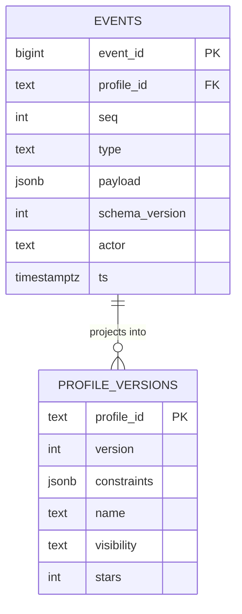
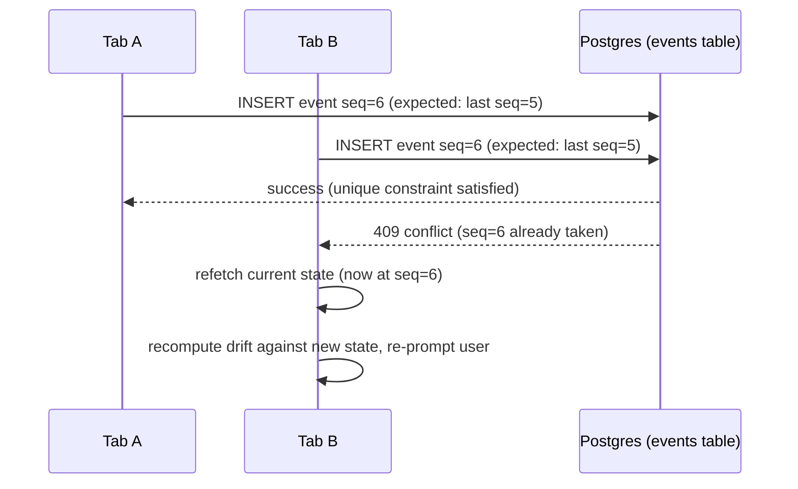
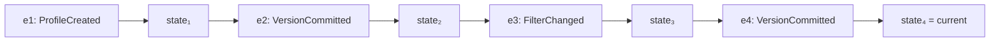
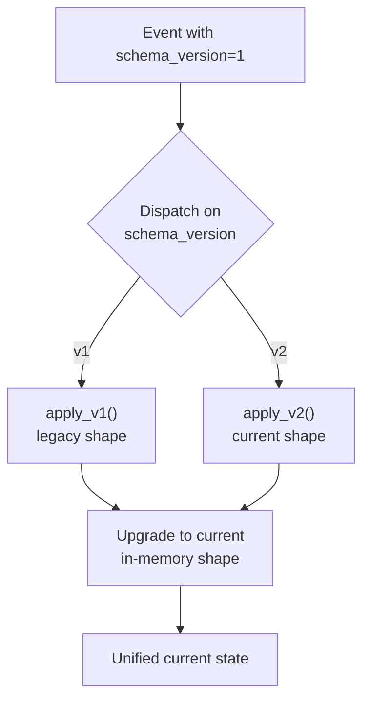

# 02 — The event-sourcing engine: technical depth

## Aggregate boundaries and the single-writer principle

In event-sourcing terminology, an **aggregate** is the unit of consistency — the boundary within which all writes must be strictly ordered. Here, the aggregate is a single **Shopping Profile**, identified by `profile_id`. Every event belongs to exactly one profile, and events within a profile are totally ordered by a monotonically increasing `seq` integer.

This boundary choice is deliberate and has a direct consequence: **cross-profile operations (like forking) never require ordering guarantees *between* two profiles' logs** — only within each one. That's what makes fork cheap (see `05-collaboration-engine.md`): it doesn't need to coordinate two aggregates, it just seeds a brand-new one.



`UNIQUE (profile_id, seq)` is the load-bearing database constraint here — it is what turns "two writers racing" into a **detectable conflict** rather than silent data loss, which is the next section.

---

## Concurrency control: optimistic concurrency, not locking

The realistic concurrency hazard in this system is narrow but real: **a user has the same profile open in two browser tabs**, or **a flaky network causes the client to retry a commit it thinks failed but actually succeeded.** Both are single-user, low-frequency scenarios — nowhere near the scale of a true multi-tenant write-contention problem — but they still need a correct answer, or a user can silently lose an edit.

**Mechanism: optimistic concurrency control (OCC) via expected sequence number**, the same principle behind HTTP's `ETag` / `If-Match` conditional writes or a compare-and-swap (CAS) operation in shared-memory concurrent programming.

1. When the client wants to commit a change, it sends the **sequence number it last read** (`expected_seq`) along with the new event.
2. The server performs the insert as: `INSERT INTO events (...) SELECT ... WHERE NOT EXISTS (SELECT 1 FROM events WHERE profile_id = $1 AND seq = $2)` inside a transaction, relying on the `UNIQUE(profile_id, seq)` constraint as the actual race-safety guarantee — even under concurrent transactions, at most one insert for a given `(profile_id, seq)` pair can succeed.
3. If the insert fails (unique violation) — meaning someone else's write already claimed that `seq` — the server returns **HTTP 409 Conflict**, not a silent overwrite.
4. The client refetches the current state, re-runs the drift computation against the *new* current version, and either re-shows the 3-way save dialog (if the two edits genuinely conflict) or auto-rebases (if they touched unrelated fields).



This is meaningfully different from **pessimistic locking** (`SELECT ... FOR UPDATE`), which would hold a row lock for the duration of a transaction and block the second writer. OCC is the right choice here because conflicts are **rare** (single user, occasional double-tab) — paying the cost of detecting and retrying on the rare conflict is cheaper than paying the cost of locking on every single write, which would also risk holding a lock across a slow client round-trip (a classic anti-pattern: never hold a DB lock across a network hop to a browser).

---

## Why one ACID transaction eliminates a whole class of bugs

The single most important database design decision: **the event insert and the projection update happen in the same transaction.**

```sql
BEGIN;
  INSERT INTO events (profile_id, seq, type, payload, actor)
    VALUES ($1, $2, 'VersionCommitted', $3, $4);
  UPDATE profile_versions
    SET version = $2, constraints = $3, updated_at = now()
    WHERE profile_id = $1;
COMMIT;
```

If the transaction fails partway (say, the projection update violates a constraint), **both statements roll back** — the event that never got reflected in the read model is never persisted either. This is what rules out the classic event-sourcing failure mode of "the log says one thing, the fast read-cache says another," which in a distributed (Kafka-consumer-based) event-sourcing setup requires careful idempotent-consumer design to avoid. Here, we get it as a **free consequence of not distributing the write path** — which is exactly the argument made in `00-architecture-philosophy.md` for why this system doesn't need message-bus infrastructure at this scale.

---

## Replay, rollback, and snapshot-bounded cost

**Deriving current state (`project`)** is a left-fold over the ordered event stream:



Each event type has an **apply function** — a pure, deterministic reducer `(state, event) -> state'`. Purity matters: replaying the same prefix of events must always produce the same state, because it's what makes rollback and fork both correct and cheap to reason about (no hidden external calls, no non-determinism inside the fold).

**Rollback** is not a deletion — it is an **append of a new `RolledBack` event** whose payload names a target version. The *projection* (read model) is recomputed by folding only up to that target version's commit point, and that recomputed state is what gets written into `profile_versions` for fast reads. The full event history — including the version being "rolled back from" — is untouched, which is what allows the user to later roll *forward* again.

**Snapshot-bounding**: as covered in `00-architecture-philosophy.md`, every 20 commits we materialize a `SnapshotTaken` event carrying the fully-computed state, so replay from that point only needs to process events since the last snapshot — bounding worst-case replay cost to a small constant, independent of a profile's total history length.

---

## Schema evolution: versioned event payloads

Because events are permanent, **the shape of a `FilterChanged` event written in week one must still be interpretable in week twelve**, even after the constraint schema gains new fields (e.g., we add `occasion` as a filterable dimension after launch). Each event carries a `schema_version` integer, and the apply function is a **dispatch table keyed by that version**:



This is the same discipline as versioning a public API, applied internally: **you never mutate the meaning of an already-written event; you add a new version and teach the reducer to understand both.**

---

## What we explicitly did not build, and the cost model that justifies it

| Not built | What it would add | Why the cost isn't justified yet |
|---|---|---|
| Async event bus (Kafka) between write and read model | Horizontal scaling of read-side consumers across services | We have one read model, one service; a bus adds latency and a new failure mode (consumer lag) for zero benefit at this scale |
| Distributed consensus (Raft, multi-region writes) | Survives a node/region failure | Single-writer-per-aggregate means there's no multi-node write conflict to resolve in the first place |
| CRDTs / operational transforms | Automatic merge of concurrent edits to shared state | We deliberately have no shared mutable state between users (see `05-collaboration-engine.md` — fork sidesteps this entirely) |

Each of these is a real technique with a real use case — the point being made is that **none of their use cases exist in this system's actual concurrency profile**, and reaching for them anyway would be complexity without a corresponding problem.
