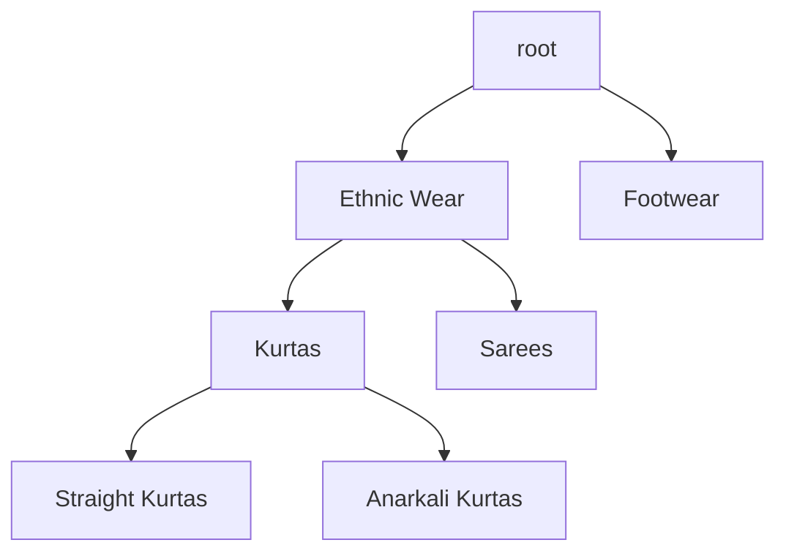
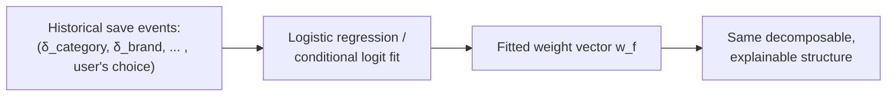

# 03 — The drift engine: technical depth

## Why this is framed as metric-space distance, not classification

The obvious "modern" approach to "is this a new intent or a refinement" is to train a classifier — feed it (old profile, new state) pairs, get a probability. We explicitly reject that approach, and the reason is a hard requirement, not a stylistic preference: **the decision must be explainable to the end user in one sentence, every single time, with no exceptions.** A classifier gives you a probability with no decomposition — you cannot ask a gradient-boosted tree "which feature contributed how much" without a separate explainability layer (SHAP values, etc.) bolted on after the fact, and even then the explanation is an approximation of the model, not the model itself.

**A weighted sum of interpretable per-field distances is, by construction, its own explanation.** The score decomposes additively: `D = Σ w_f · δ_f`, so "why did we recommend X" is answered by literally printing the terms of the sum. This is the actual engineering argument for choosing a transparent linear model over a more "sophisticated" black box: **the explainability isn't a nice-to-have UI feature, it's the reason the mathematical form was chosen in the first place.**

---

## Choosing the per-field distance functions, formally

### Set-valued fields (brand, colour, fabric, sleeve): Jaccard distance

For two sets *A* and *B* (e.g., saved colours `{blue, green}` vs. new colours `{blue, red}`):

```
Jaccard similarity  J(A,B) = |A ∩ B| / |A ∪ B|
Jaccard distance     δ(A,B) = 1 − J(A,B)
```

This is chosen over a naive alternative like "count of differing elements" for a precise reason: **Jaccard distance is a true metric** — it satisfies non-negativity, symmetry, and the triangle inequality — which means distances computed this way compose sensibly (a property a naive count-based measure does not guarantee, especially when set sizes differ). It is also **bounded to [0, 1]**, which is required because we're summing it against fields of very different natural scale (a price range vs. a small brand list) — every `δ_f` must live on the same [0, 1] scale before the weights can mean anything comparable.

**Edge case handled explicitly**: if both sets are empty (`A = B = ∅`), the union is also empty and the formula divides by zero. We define `δ(∅, ∅) = 0` by convention (no information, no distance) — this must be handled as a special case in code, not left to produce a NaN.

### Numeric range fields (price): interval overlap distance

For two ranges `[minA, maxA]` and `[minB, maxB]`:

```
overlap = max(0, min(maxA, maxB) − max(minA, minB))
union   = max(maxA, maxB) − min(minA, minB)
δ = 1 − overlap / union
```

This is the direct numeric analogue of Jaccard distance for intervals rather than sets — same intuition (overlap relative to the combined span), same [0,1] bound. **Edge case**: if the two ranges are identical single points (`union = 0`), we define `δ = 0` (no distance) rather than dividing by zero.

### Category field: taxonomy tree distance, not a flat categorical comparison

This is the field that carries the dominant weight, so its distance function deserves the most scrutiny. **We do not treat category as a flat "same or different" boolean** — we treat Myntra's product taxonomy as a **tree** (e.g., root → *Ethnic Wear* → *Kurtas* → *Straight Kurtas*), and define distance as a function of **tree structure**, specifically the depth of the lowest common ancestor (LCA) relative to the tree's depth:

```
δ_category = 1 − (depth of LCA(old_category, new_category) / max_tree_depth)
```



- Straight Kurtas → Anarkali Kurtas: LCA is *Kurtas* (deep in the tree) → small distance, a refinement.
- Straight Kurtas → Sarees: LCA is *Ethnic Wear* (shallower) → medium distance.
- Straight Kurtas → any Footwear: LCA is *root* (shallowest possible) → **δ = 1, maximum distance.**

**This is the important design insight**: the "category vertical jump = always new profile" override rule from the simplified explanation is not actually a separate special case bolted onto the algorithm — **it falls out naturally as the boundary condition of the same tree-distance formula** (LCA = root implies δ = 1, the maximum possible value, which alone is enough to push the weighted sum past the "new profile" threshold given `w_category = 0.60`). Framing it this way is more defensible under scrutiny than an ad hoc `if` statement, because it means the "dominant rule" is a *consequence* of a single, principled distance function applied consistently — not an exception carved out on top of it.

---

## The weight vector: what it represents and how it would be learned

The current weights (`w_category=0.60, w_brand=0.12, w_fabric=0.10, w_price=0.08, w_color=0.05, w_sleeve=0.03, w_size=0.02`) are a **hand-set prior**, and it's important to be precise about what that means and what the principled alternative looks like, because "we picked these numbers" is a fair challenge to anticipate.

**How they'd actually be learned from data**: frame it as a **binary/multinomial logistic regression** (or a conditional logit model) where:
- The **features** are the per-field distances `δ_f` for each of a user's real save events.
- The **label** is the choice the user actually made when prompted: `{Update, New Version, New Profile}`.
- The **fitted coefficients of the logistic regression *are* the weights** — the model form doesn't change (it's still a weighted linear combination inside a logistic link function), only the coefficients become data-derived rather than hand-set.



**Why this preserves explainability even after learning**: because the *functional form* stays a weighted linear sum, not a black-box classifier, the same "here's exactly how much each field contributed" decomposition still applies after the weights are learned from data. The transparency isn't lost when the numbers get more rigorous — it's a property of the model class, not of the specific weight values chosen. This is precisely the answer to "so you just guessed the weights" — the guess is a bootstrap prior with a named, standard method to replace it once usage data exists.

---

## Computational complexity and latency budget

Per drift computation: `O(F)` where `F` is the number of constraint fields (currently ~7). Each `δ_f` computation is itself `O(|A| + |B|)` for set operations (set union/intersection via hash sets) or `O(1)` for range/tree lookups. **There is no model inference involved** — no forward pass through a neural network, no external API call. This means the entire drift computation, unlike the fuzzy compiler (`04-fuzzy-compiler.md`), completes in **microseconds, not the hundreds of milliseconds an LLM round-trip would cost.** This is an explicit, deliberate trade-off: we chose a design that is simultaneously *more* explainable and *faster* than an ML alternative — a rare case where the "responsible" choice and the "performant" choice point the same direction.

## Edge cases handled explicitly

| Case | Handling |
|---|---|
| A field present in the saved profile but absent from the live state (e.g., user cleared a filter entirely) | Field excluded from the sum, and the total is re-normalized by the sum of weights of fields that *are* present on both sides — otherwise a cleared field would look identical to "field kept but changed to the same value," which is not the same signal |
| All fields identical | `D = 0` exactly, floor of the "update in place" band |
| Multiple fields changed simultaneously | Distances are independent per field and simply summed — no cross-term/interaction effects modeled in v1; flagged as a roadmap item (interaction effects would need a richer model, at the cost of the current architecture's transparency) |
| A brand-new field type introduced later (schema evolution) | New field gets a new `δ_f` function and a weight; existing profiles without that field treated per the "field absent" rule above |
