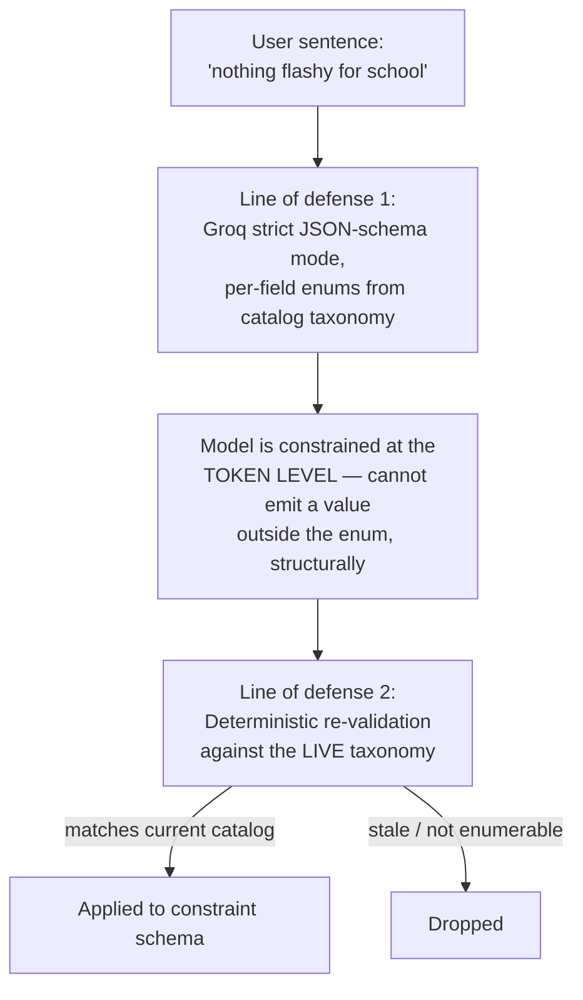
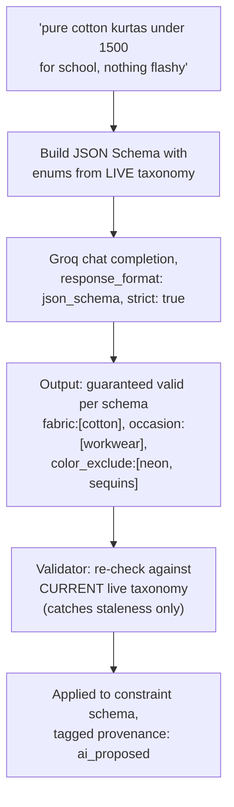

# 04 — The fuzzy-intent compiler: technical depth (v2 — revised for Groq)

> **Revision note**: the original version of this document claimed true constrained decoding "requires local weight access, not available with a hosted API," and treated propose-then-validate as the ceiling of what's achievable. That claim is corrected here: because Groq serves open-weight models on hardware it controls, its Structured Outputs API with `strict: true` performs genuine constrained decoding at the token level, not merely prompt-engineered JSON formatting. This materially strengthens the architecture below. See `CHANGELOG.md` for the full before/after.

---

## The corrected picture: two independent lines of defense, not one

The original design used a single safety mechanism: let the model propose freely, then validate every proposal against a taxonomy dictionary afterward, dropping anything invalid. That remains **necessary**, but with Groq it is no longer the *only* mechanism — it's now the second of two independent lines of defense:



---

## Line of defense 1: schema-level constrained decoding, for real this time

Groq's Structured Outputs feature, used with `response_format: { type: "json_schema", json_schema: { ..., strict: true } }`, guarantees the model's output conforms to the supplied JSON Schema by **constraining which tokens can be sampled at each generation step** — not by hoping the model follows instructions, and not by retrying until valid JSON happens to come out. This is the real mechanism the original document assumed was unavailable outside of local-weight access; it turns out Groq exposes exactly this, as a hosted feature, because they control both the model weights and the inference stack (the LPU).

**The key move that makes this useful for our specific problem (not just "valid JSON," but "a value that actually exists in Myntra's catalog")**: define each filterable field in the JSON Schema as an `enum` populated from the **live catalog taxonomy** at request time — not a fixed list baked into a prompt, but generated fresh from the same taxonomy dictionary the validator (line of defense 2) also reads from.

```json
{
  "type": "object",
  "properties": {
    "fabric": { "type": "array", "items": { "enum": ["cotton", "linen", "rayon", "silk", "..."] } },
    "color_exclude": { "type": "array", "items": { "enum": ["neon", "sequins", "metallic", "..."] } },
    "occasion": { "type": "array", "items": { "enum": ["workwear", "casual", "festive", "..."] } }
  }
}
```

With `strict: true`, Groq's own documentation states this mode uses constrained decoding to guarantee the output will always match the schema exactly, constrained at the token level so the model is structurally incapable of generating a non-conforming value. Concretely: **it becomes impossible for the model to emit `"breathable-luxe"` for the `fabric` field**, because that token sequence was never a legal continuation in the first place — not "the model was told not to and complied," but "the sampling space didn't contain that option." This is the difference between the propose-then-validate architecture from the original document and true grammar-constrained generation, and it is a meaningfully stronger guarantee.

---

## Why line of defense 2 (the validator) is still necessary, not redundant

It would be tempting to conclude "we now have perfect constrained decoding, drop the validator." That's wrong, for two concrete reasons worth stating precisely:

1. **Schema staleness.** The enum list is generated from the taxonomy dictionary *at the moment the request is built*. If the catalog changes between when the schema was generated and when the response is used (a new fabric type added, an old one deprecated), the schema itself could be stale. The independent validator re-checks against the *current* live taxonomy at apply-time, catching a narrow but real window the schema-generation step can't.
2. **Cross-field constraints aren't expressible in flat per-field enums.** A rule like "if `category = kids-wear`, only allow `size` values from the children's size range" is a **conditional, cross-field grammar** — flat JSON Schema enums describe valid values for one field in isolation, not conditional relationships between fields. Expressing that would require a more elaborate schema (or a grammar system beyond flat enums), which isn't attempted in v1. The validator remains the general-purpose backstop for exactly this class of constraint that the schema-enum approach can't cover on its own.

So the corrected framing is: **schema-level constrained decoding handles the common case with a hard, structural guarantee; the validator handles staleness and any constraint the flat schema can't express.** Defense-in-depth, not redundancy — each layer catches a distinct failure mode the other doesn't.

---

## Latency: why Groq specifically, not just "an LLM API"

The original document's latency estimate (500ms–1.5s per call) assumed a typical hosted LLM API. Groq's entire value proposition is different: it runs models on the LPU (Language Processing Unit), custom silicon built specifically for the sequential, memory-bandwidth-heavy pattern of transformer inference, rather than a repurposed general-purpose GPU. Published throughput figures put small models well over 900 tokens/second, with mid-sized models (the class suitable for this task) still an order of magnitude faster than typical GPU-served APIs. For a short structured-extraction task like this (a handful of output tokens — a small JSON object, not a paragraph), the realistic round trip drops well below the original estimate, which is precisely what's needed for "the compiler must feel instant" to be true in practice rather than aspirational. Model/pricing specifics should be checked against Groq's current model list at implementation time (this rotates), but the architecture below — strict JSON-schema mode with catalog-derived enums, backstopped by the validator — holds regardless of which specific model is selected.

---

## Updated pipeline diagram



## Fallback ladder, unchanged in structure

The graceful-degradation ladder from the original design is unaffected by this upgrade and still applies exactly as before: Groq unreachable or timing out → deterministic lexicon-only keyword matcher (no network call) → no-op, user finishes the profile by hand via ordinary filters. Each rung remains a strictly weaker but still-correct behavior; the schema-enum upgrade makes the *top* rung stronger, it doesn't change what happens when that rung isn't available.

## Why we still don't attempt to "correct" a rejected value

This point from the original document is unchanged and arguably reinforced: even with schema-constrained generation making bad output far rarer, the response to anything line of defense 2 still catches (the narrow staleness/cross-field cases) remains **drop, never guess a replacement**. Auto-correcting a rejected value reintroduces exactly the uncertainty the whole two-layer design exists to eliminate — a dropped, absent filter is recoverable by the user noticing and adding it manually; a silently "corrected" one is not.
