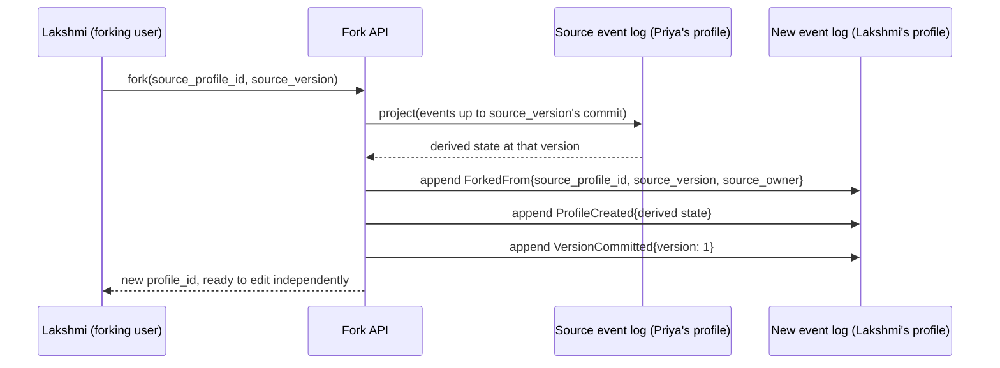
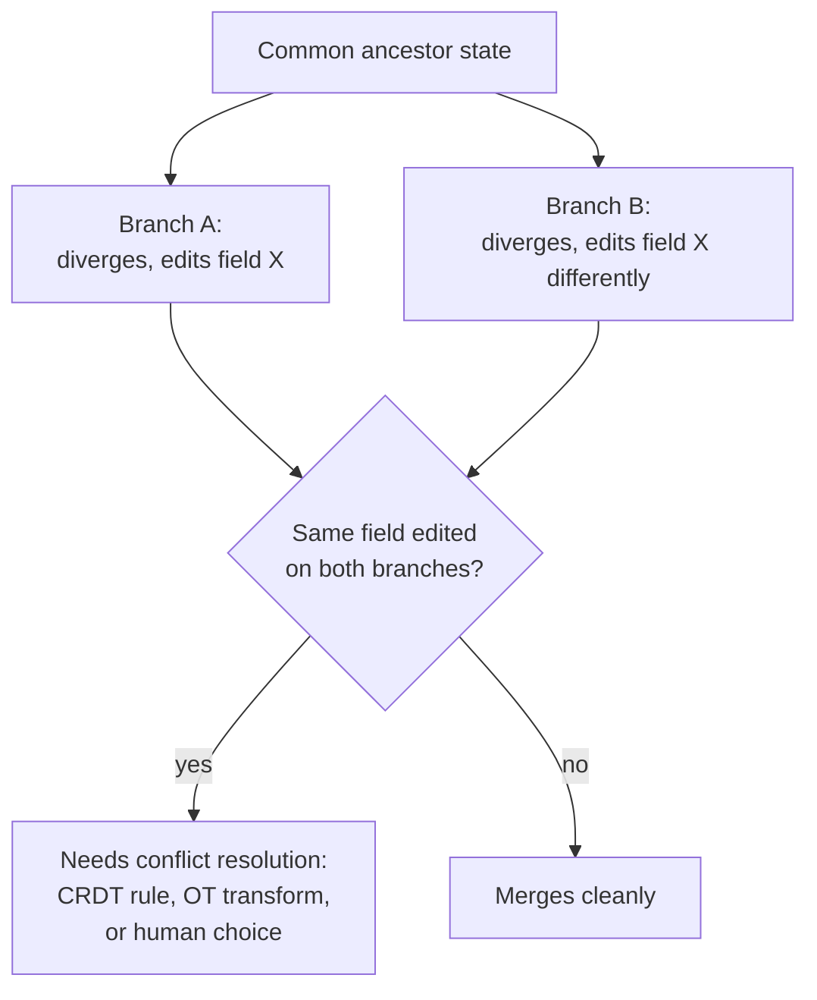
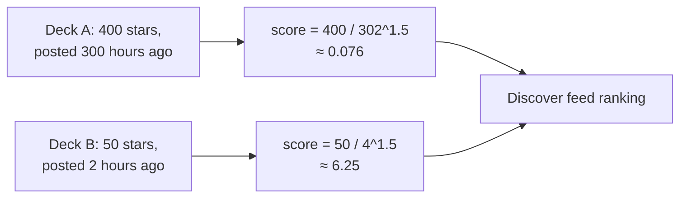
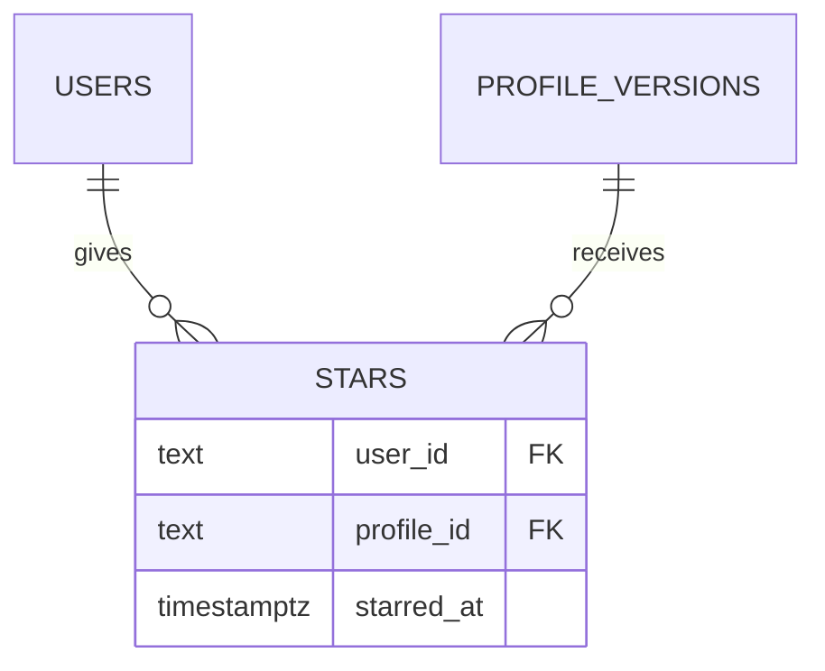

# 05 — The collaboration engine: fork, star, discover — technical depth

## Fork, formalized as a structural operation on the event log

A fork is not a copy of a row. It is defined precisely as: **replay the source profile's event log up to a chosen commit point, and re-emit the resulting derived state as the seed of a brand-new, independent aggregate under a different owner.**



The `ForkedFrom` event is the only place provenance is recorded, and it carries `(source_profile_id, source_version, source_owner)` — this is what lets the system answer, later, "how many variants has this deck spawned" by treating fork relationships as a **directed graph** rather than throwing the lineage away. That graph structure is what enables a future feature (explicitly deferred to roadmap) of visualizing a deck's "fork tree" — but the graph itself is being captured *now*, at zero extra cost, because it's just one more field on one event.

### Cost analysis: fork is not a special, expensive operation

Forking costs **exactly the same as loading your own profile**: `O(N)` where *N* is the number of events up to the fork point (or `O(k)` with snapshotting, per `02-event-sourcing-engine.md`). There is no additional complexity class introduced by forking — it reuses the identical `project()` function used for every normal profile load. This is worth stating plainly because it answers the natural scaling worry ("what if a popular deck gets forked 10,000 times") — each fork is an independent, cheap, `O(k)` operation against the *source's* log; forks do not contend with each other, do not lock the source profile, and do not grow more expensive as more forks happen, because each fork only ever reads the source once and then writes into its own entirely separate log.

---

## Why there is no merge — and what merge would actually require

It's worth being precise about *why* forking sidesteps one of the genuinely hard problems in distributed systems, rather than just asserting "we don't need it."

**True collaborative version control (like Git's merge, or a real-time collaborative document) requires reconciling divergent histories that share a common ancestor.** That means:

1. Finding the **common ancestor** commit of two diverged branches.
2. Computing the **diff** each branch introduced relative to that ancestor.
3. **Reconciling** those diffs — which is trivial if they touch disjoint fields, and requires a **conflict-resolution policy** if they touch the same field (this is where real merge tools ask a human, or where CRDTs / Operational Transforms apply a mathematically-defined resolution rule automatically).



**A fork, by construction, never re-enters this problem**, because after the fork point, the two logs (`profile_id = A` and `profile_id = B`) are **provably independent aggregates with separate sequence spaces.** There is no operation in the system that ever tries to reconcile them — nothing calls `merge(A, B)`. The "hard problem" isn't solved cheaply; **it's architecturally avoided**, because the two histories are never asked to become one history again. This is the honest technical answer to "why didn't you build real collaboration" — it's not that CRDTs are too hard to implement in three days (though they are); it's that the **product decision** (fork = independent copy, not co-editing) removes the need for that machinery entirely. If the product later needs true co-editing of one shared deck, *that* is when CRDT/OT machinery becomes necessary — and it is called out precisely for that reason in the roadmap, not treated as an oversight.

---

## Discover ranking: why not just "sort by star count"

A naive discover feed sorted by raw star count has a well-known failure mode: **early popularity compounds.** A deck that reached 400 stars in its first week continues to rank above a deck that reached 350 stars *organically and recently*, indefinitely, because raw counts never decay. This starves new, currently-relevant content of visibility — the same problem link-aggregator sites (Hacker News, Reddit) solved decades ago with **time-decayed scoring functions.**

**We use a gravity-style decay formula**, directly adapted from that lineage:

```
score = stars / (age_in_hours + 2) ^ gravity
```

Where `gravity` (commonly ~1.5) controls how aggressively older content is discounted. A deck with 50 stars posted 2 hours ago can outrank a deck with 400 stars posted 300 hours ago, because the denominator grows so much faster for the old one. The `+ 2` constant prevents brand-new decks (age ≈ 0) from producing a division that makes early stars disproportionately dominant.



This is recomputed at query time (or refreshed on a short cache TTL) rather than stored as a static field, because the score's whole point is that it changes continuously as `age_in_hours` grows even with zero new stars — a stored, unrefreshed score would silently go stale in exactly the way the formula is designed to prevent.

---

## Consistency model for stars: idempotent toggling, not a raw counter increment

A tempting simple implementation — `UPDATE decks SET stars = stars + 1` on every star click — has two real problems: **it's not idempotent** (a double-click, a retried request after a network blip, or a user re-clicking to un-star and re-star all corrupt the count), and **it can't answer "did I star this"** without separate state.

**Correct design: a `stars` join table** with a `UNIQUE(user_id, profile_id)` constraint:



Starring is `INSERT INTO stars ... ON CONFLICT (user_id, profile_id) DO NOTHING` (idempotent — repeated clicks are safe); un-starring is a `DELETE`; the **displayed star count is `COUNT(*)` grouped by `profile_id`**, not a manually-maintained integer column, which means it can never drift out of sync with the actual set of users who starred it — the count is *derived*, following the exact same "don't store what you can correctly compute" philosophy that motivates event sourcing in the first place. This also directly answers "has this user already starred this deck" with a single indexed lookup, which the raw-counter approach cannot do at all.

## Why the demand-signal feature is nearly free

Aggregating "most-starred decks with poor catalog coverage" (the merchandising-insight feature) requires no new data collection — it's a join between the `stars`/`decks` tables (already required for Discover) and the coverage-count computation (already required for the Coverage Advisor, `06-coverage-diff-engine.md`). It's presented as a distinct business-value feature in the pitch, but architecturally it is a **read-only aggregate query over data the system is already collecting for other reasons** — a good example of how a clean data model lets one additional insight fall out of the intersection of two existing features rather than requiring new instrumentation.
