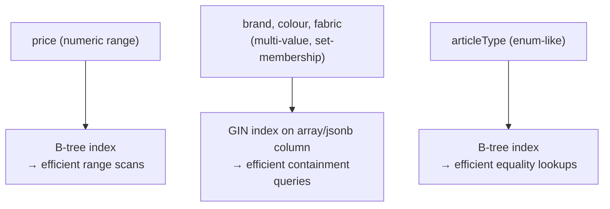
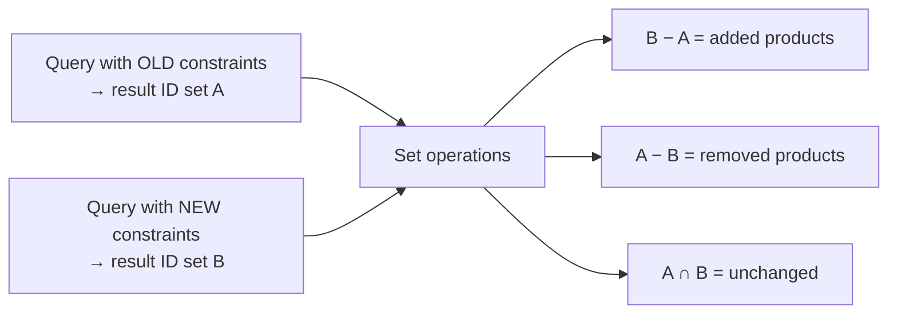

# 06 — Coverage advisor and dry-run diff: technical depth

## The naive approach, and why it doesn't scale

The Coverage Advisor's job — "which single filter, if relaxed, unlocks the most additional products" — has an obvious brute-force implementation: **for each of the F applied filters, remove it, re-run the full query against the catalog, and count the results.** That's `F` separate full-catalog queries per invocation.

At hackathon catalog scale (5,000–20,000 rows), this is genuinely fine — but it's worth reasoning about *why* it's fine, rather than assuming it, because the same approach at Myntra's real catalog scale (hundreds of thousands of SKUs, millions of concurrent shoppers) would not be.

## Making each count cheap: indexing strategy, not query cleverness

The determining factor for whether "count matching rows" is fast is **whether the query planner can use an index rather than a sequential scan.** Each filter type needs a deliberately chosen index structure:

- **Numeric ranges** (price) want a standard **B-tree index** — range queries (`price BETWEEN x AND y`) are exactly what B-trees are built for, giving `O(log n)` lookup plus a linear scan of the matching range.
- **Multi-value categorical fields** (brand, colour, fabric — where a product can match one of several included values, and where our own filters are themselves multi-valued) want a **GIN index over an array or JSONB column**, using Postgres's containment operators (`@>`, `&&`). A plain B-tree does not efficiently support "does this row's array intersect that set of values" — GIN is the structure built for exactly that access pattern.
- **Enum-like single-value fields** (articleType, size) are simple B-tree equality lookups.

With correct indexing, each of the `F` re-count queries is an indexed lookup, not a sequential table scan — the total cost for one Coverage Advisor invocation is **`O(F · log n)`**, not `O(F · n)`. At F ≈ 7 and n in the tens of thousands, this is comfortably sub-100ms, which matters because the advisor is meant to feel instantaneous in the UI, not like a background job the user waits on.

## Where this approach stops scaling, stated honestly

The re-query-per-field approach is **linear in the number of filters, not in the number of products** — so it remains fast even as the catalog grows, as long as indexes are maintained. Where it *does* break down is if the **number of filterable dimensions grows very large** (dozens of facets), since each added facet is one more full re-query. At true Myntra scale, the standard production answer is a **faceted search engine** (Elasticsearch or OpenSearch aggregations, or Algolia's facet counts) which computes **all facet counts in a single pass** over the result set rather than one query per facet — this is explicitly named as the production upgrade path and deliberately not built for the MVP, since standing up a search cluster for a 5,000-row demo catalog would be solving a scaling problem that does not yet exist.

---

## The dry-run diff: a set-difference problem, computed cheaply

The preview feature ("+240 added, −60 removed") requires computing the **symmetric difference** between two result sets: the products matching the *old* saved constraints, and the products matching the *new, unsaved* working state.

**Implementation choice**: rather than pulling both full ID lists into the application layer and diffing them in Python, this is pushed down to the database as SQL set operations (`EXCEPT` for the "added"/"removed" sets, or an equivalent anti-join), because Postgres can execute these using the same indexed scans as the underlying filtered queries, and returning only the (typically much smaller) *difference* sets avoids transferring two potentially large ID lists over the wire just to diff them in application code. The cost is dominated by the two underlying indexed filter queries, with the set operation itself an inexpensive additional step — `O(|A| + |B|)` at worst, using hash-based set operations internally.

**Why counts alone aren't enough for this feature, but were enough for the Coverage Advisor**: the Coverage Advisor only needs *counts* (how many, not which), so it can stop at `COUNT(*)`. The dry-run diff needs actual *product identities* (to say "mostly Aurelia" and to eventually render the specific products, if the UI goes that far) — which is why it's architected as a genuinely separate query pattern (`SELECT id`) rather than reusing the Coverage Advisor's `COUNT(*)` queries, even though both start from the same underlying filtered-query building blocks.

## Precision honesty: what "mostly Aurelia" actually requires

To render a diff summary like "+240 added, mostly Aurelia," the system doesn't just compute the added-set size — it runs a lightweight **`GROUP BY brand` aggregation over the added-set**, and surfaces the modal brand (most frequent value) as the human-readable summary. This is a second, small aggregate query over an already-small result set (the diff, not the whole catalog), so its cost is negligible relative to the two main filtered queries — but it's worth naming explicitly as a distinct query, not something the diff computation produces "for free," since a viewer reasoning about the system's cost model should be able to account for every query it issues.
