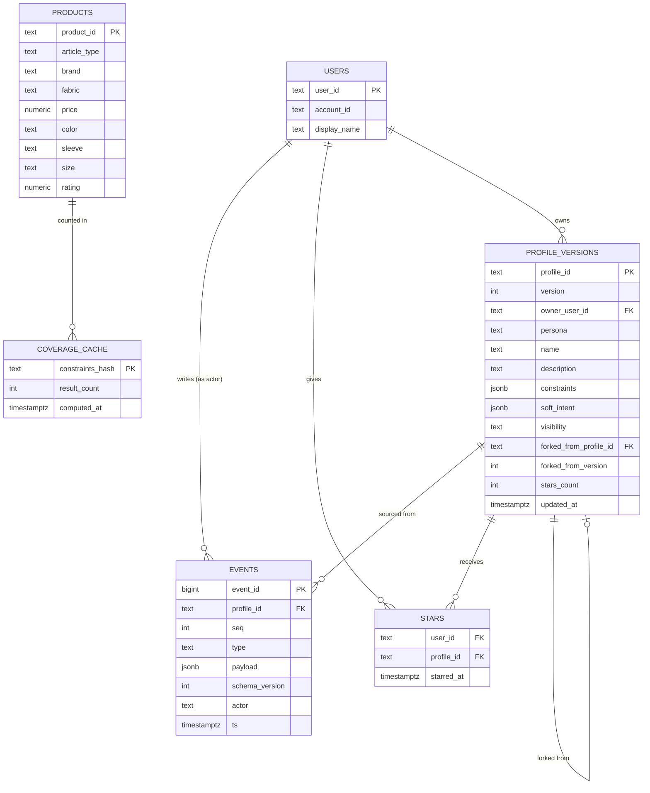

# 07 — Database schema: technical depth

## Why Postgres, and not a document store, for this data

The temptation with an "events as JSON blobs" system is to reach for a document database (MongoDB, DynamoDB) since events are naturally JSON-shaped. **We reject this in favor of Postgres with a JSONB payload column**, for a reason specific to this system's requirements, not a general preference: **the event insert and the projection update must happen in one ACID transaction** (established in `02-event-sourcing-engine.md`), and most document databases either don't support true multi-document ACID transactions, or support them with significant caveats and performance cost. Postgres gives us **relational structure where we need joins** (fork provenance, the social graph of stars/decks) **and document flexibility where we need it** (JSONB for event payloads and constraint schemas, which genuinely do vary in shape across event/field types) — the best of both, in one engine, with one connection pool, one backup strategy, and one transaction boundary.

---

## Entity-relationship diagram



---

## Table-by-table indexing rationale

### `events` — the write model (source of truth)

```sql
CREATE TABLE events (
    event_id        BIGSERIAL PRIMARY KEY,
    profile_id      TEXT NOT NULL,
    seq             INT  NOT NULL,
    type            TEXT NOT NULL,
    payload         JSONB NOT NULL,
    schema_version  INT NOT NULL DEFAULT 1,
    actor           TEXT NOT NULL,
    ts              TIMESTAMPTZ DEFAULT now(),
    UNIQUE (profile_id, seq)
);
CREATE INDEX idx_events_profile_seq ON events (profile_id, seq);
```

- **`UNIQUE(profile_id, seq)`** is not just a correctness constraint — it is the concurrency-control mechanism itself (`02-event-sourcing-engine.md`). Its existence *is* what turns a race condition into a detectable, returnable 409 rather than silent data corruption.
- **`idx_events_profile_seq`** exists because the single most frequent read pattern in the entire system is "give me all events for this profile, in order" (needed for every project/replay/rollback/fork operation) — this composite index makes that an index range scan rather than a full-table scan filtered by `profile_id`.
- Deliberately **no index on `payload`** at MVP scale — JSONB querying inside event payloads isn't a hot path (we always read the whole payload and let the application-layer reducer interpret it), so a GIN index there would be pure write-amplification with no matching read benefit.

### `profile_versions` — the read model (disposable projection)

Indexed on `(owner_user_id, persona)` — the second most frequent query pattern is "give me this user's profiles for their currently active persona" (populating the side panel's profile list), and on `(visibility, stars_count)` — supporting the Discover feed's need to filter to public decks and pre-sort by a rough popularity signal before the time-decay re-ranking (`05-collaboration-engine.md`) is applied on top.

Being explicit about the fact that **this whole table is a cache**: it can be dropped and fully rebuilt by replaying every profile's event log from scratch. This property is what justifies treating its indexing choices purely on read-performance grounds, without worrying about durability — durability lives entirely in `events`.

### `stars` — idempotent join table

`PRIMARY KEY (user_id, profile_id)` (not a separate surrogate key) — this is deliberate: making the natural key the primary key is what makes `INSERT ... ON CONFLICT DO NOTHING` a correct, idempotent starring operation with zero extra application logic, as detailed in `05-collaboration-engine.md`.

### `products` — the catalog (a proxy dataset, not Myntra's real DB)

Indexes: B-tree on `price` (range queries), GIN on any multi-value columns modeled as arrays, B-tree on `article_type` and `size` (equality lookups) — the full rationale is in `06-coverage-diff-engine.md`, since this table exists specifically to make the Coverage Advisor and dry-run diff queries fast.

### `coverage_cache` — an optional memoization layer

Keyed on a **hash of the canonical, serialized constraint object** (using the Adapter's canonical serialization from `01-adapter-layer.md` — the same idempotency property that keeps drift detection stable also lets us safely cache coverage counts, since identical logical constraints always hash identically regardless of filter order). This is an optimization, not a correctness requirement: if a coverage count is requested for a constraint combination that's been computed recently, skip the re-query. Given the small catalog size at hackathon scale this is likely unnecessary, but it's included in the schema because it's a natural, low-cost addition once the constraint-hashing discipline already exists for other reasons.

---

## Why the read model and the catalog are architecturally separate concerns

It's worth being explicit that `profile_versions` (derived from *our own* event log) and `products` (a proxy for Myntra's real catalog) are **conceptually different kinds of data with different consistency requirements** — `profile_versions` must never be out of sync with `events` (hence the same-transaction guarantee), while `products` is inherently a **stale, periodically-refreshed mirror** of an external system we don't own. Treating them as the same kind of table would obscure a real distinction: one is *authoritative data we produce*, the other is *cached data we consume*. This distinction is also why the eventual first-party integration path (replacing our synthetic catalog with a live read from Myntra's actual product database) only touches the `products` table and its ingestion job — it never touches the event-sourcing core, because the two were kept structurally separate from the start.
