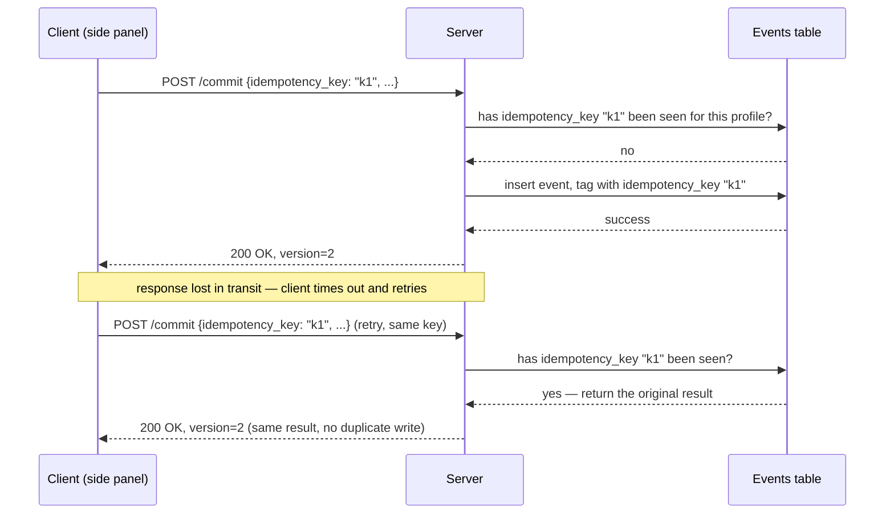

# 08 — API contracts: technical depth

## Idempotency keys: why "just retry on failure" is not safe by default

The side panel runs in a browser extension on a real user's laptop, over a real (sometimes flaky) network. A common failure mode in any client-server system is: **the client sends a commit request, the server processes it successfully and writes the event, but the response is lost in transit** (dropped connection, timeout). The naive client behavior — "no response, so retry" — would, without protection, **append the same `VersionCommitted` event twice**, silently corrupting the profile's history with a duplicate version.

**Mitigation: every mutating request carries a client-generated idempotency key** (a UUID generated once per user action, not per HTTP attempt). The server, before processing a commit, checks whether an event with that idempotency key has already been recorded for that profile; if so, it returns the **original** result rather than reprocessing.

This is the standard pattern used by payment APIs (Stripe, for instance) for exactly this reason — **any mutating operation reachable over an unreliable network needs an idempotency mechanism**, not just "hope the network doesn't drop packets," and a shopping-preference commit is no exception just because money isn't directly involved: a duplicated version still corrupts the user's trusted history, which is the entire value proposition of the product.

---

## Endpoint contracts

### `POST /profiles` — create a new profile

| | |
|---|---|
| **Request** | `{ name, description?, constraints, visibility, idempotency_key }` |
| **Response 201** | `{ profile_id, version: 1 }` |
| **Response 409** | idempotency key already used with different payload — treated as a client bug, not a valid retry |

### `POST /profiles/{id}/commit` — save a version (or update in place)

| | |
|---|---|
| **Request** | `{ expected_seq, mode: "new_version" \| "update" \| "new_profile", constraints_diff, idempotency_key }` |
| **Response 200** | `{ new_version, drift_reason_shown }` |
| **Response 409** | `expected_seq` stale — someone/something else committed since the client last read (see `02-event-sourcing-engine.md`'s optimistic concurrency section); client must refetch and recompute drift before retrying |

**Why `expected_seq` is a required field, not optional**: this is precisely the compare-and-swap mechanism discussed in the concurrency section — omitting it would mean the server accepts a commit "blind," with no way to detect that the client's view of the profile is stale. Making it mandatory in the contract, rather than an optional safety check, is a deliberate API design choice: **it's structurally impossible to call this endpoint without stating what state you think you're building on top of.**

### `GET /profiles/{id}/drift?live_state=...` — ask which save option to recommend

| | |
|---|---|
| **Request (query)** | the client's current live constraint state, canonically serialized |
| **Response 200** | `{ drift_score, recommended_action, reason: string, field_contributions: {field: value} }` |

`field_contributions` is returned explicitly, not just the final recommendation — this is a direct API-level expression of the explainability requirement from `03-drift-engine.md`: the client can render "category contributed 0.60, brand contributed 0.12" without the server hiding its reasoning behind a single opaque verdict.

### `POST /profiles/{id}/rollback` — restore an earlier version

| | |
|---|---|
| **Request** | `{ target_version, idempotency_key }` |
| **Response 200** | `{ current_version: target_version }` |

Internally appends a `RolledBack` event rather than deleting anything — the endpoint's effect is additive to the log even though it feels subtractive to the user (see `02-event-sourcing-engine.md`).

### `POST /decks/{id}/fork` — copy a public deck into the caller's account

| | |
|---|---|
| **Request** | `{ source_version, idempotency_key }` |
| **Response 201** | `{ new_profile_id, version: 1 }` |

Note this endpoint takes **no `expected_seq`** — because it creates a brand-new aggregate rather than mutating an existing one, there is nothing to race against (per the independence argument in `05-collaboration-engine.md`).

### `POST /decks/{id}/star` — idempotent toggle

| | |
|---|---|
| **Request** | none beyond auth — no body needed, the operation is inherently idempotent per the schema design in `07-database-schema.md` |
| **Response 200** | `{ starred: true, stars_count }` |

No idempotency key required here specifically *because* the underlying `INSERT ... ON CONFLICT DO NOTHING` on a `(user_id, profile_id)` primary key is already naturally idempotent — a rare case where the data model itself removes the need for the request-level idempotency-key mechanism used everywhere else.

### `GET /coverage?constraints=...` and `GET /diff?old=...&new=...`

Read-only, no idempotency concerns (GET requests are naturally safe to retry). Both accept **canonically serialized** constraint objects as query parameters — reusing the same canonicalization discipline established in the Adapter (`01-adapter-layer.md`), so that the `coverage_cache` hash key (`07-database-schema.md`) and the semantics of "same constraints" stay consistent across every part of the system that needs to compare two constraint sets for equality.

---

## Error-handling philosophy: distinguishing client-fixable from system failures

| HTTP status | Meaning in this system | Client behavior |
|---|---|---|
| 409 (commit) | Optimistic concurrency conflict — someone else's write won the race | Refetch state, recompute drift, re-prompt user |
| 409 (profile create) | Idempotency key reused with a different payload | Client bug — surfaced as an internal error, not retried |
| 422 | Constraint schema failed validation (e.g., a filter value not in the live taxonomy) | Reject at the boundary before it ever reaches the event log — the log must never contain an event that would fail to replay |
| 5xx | Genuine server/database failure | Client retries the *same* idempotency key — safe by construction |

The 422 case deserves a specific note: **validation happens before the event is ever appended**, not after. This matters because the event log is meant to be a source of unconditional truth — if invalid data could get *into* the log, then replaying it later could fail or produce corrupted state, silently reintroducing the exact problem event sourcing is meant to eliminate. The boundary check exists precisely to protect the invariant that **every event in the log is, by construction, one that can always be safely replayed.**
