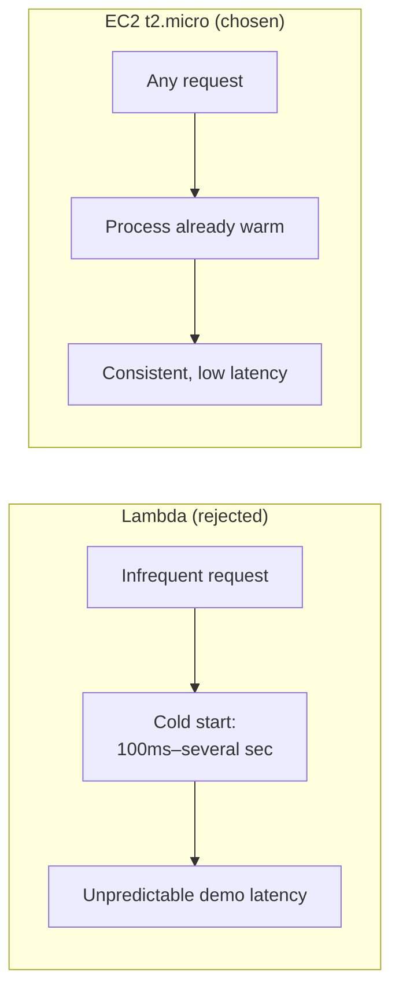
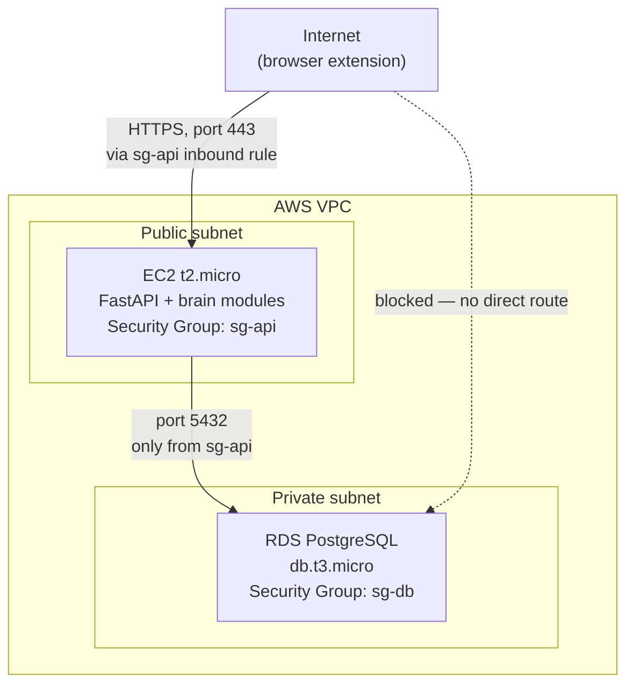

# 09 — AWS infrastructure: technical depth

## EC2 vs. Lambda: a latency argument, not a cost argument

The obvious "modern serverless" instinct is to run the FastAPI backend on AWS Lambda behind API Gateway — no server to manage, scales to zero. **We deliberately chose EC2 instead, and the reasoning is specific to this project's actual risk profile, not a general preference for servers over serverless.**

The determining factor is **cold-start latency during a live jury demo.** Lambda functions that haven't been invoked recently incur a "cold start" — the runtime has to initialize before handling the first request, commonly adding hundreds of milliseconds to low-single-digit seconds depending on runtime and package size. For most workloads this is an acceptable trade-off for not managing infrastructure. **For a live demo where a jury is actively clicking through the prototype and judging responsiveness, an unpredictable multi-second stall on an infrequently-hit endpoint (say, the drift or fork endpoint, which won't be called every few seconds) reads as a broken product, not a slow one** — and the risk is entirely uncorrelated with actual system quality; it's an artifact of the invocation pattern of a live demo, not of the architecture's real merit.

**EC2 (t2.micro, always running) gives predictable, consistent latency regardless of how recently an endpoint was hit** — the trade-off is that the instance costs uptime-hours instead of scaling to zero, which is irrelevant at hackathon scale (AWS Free Tier covers 750 hours/month of t2.micro, comfortably more than a month of continuous uptime) and is explicitly the right call given the actual failure mode being protected against.

---

## RDS vs. self-managed Postgres on the same EC2 instance

The other tempting shortcut: run Postgres directly on the same EC2 instance as the FastAPI app, avoiding a second AWS service entirely. **We use RDS (managed Postgres) instead**, for two concrete, non-cosmetic reasons:

1. **Automated backups and point-in-time recovery.** RDS takes automated daily snapshots and maintains a transaction log that allows restoring to any point within the retention window. This is a genuinely load-bearing feature for *this specific product*, not a generic best practice: **the entire pitch is that we never lose a user's history and can always roll back to any prior state.** If the underlying infrastructure storing that history has no equivalent guarantee for the system's own operator, that's a real inconsistency worth avoiding — the product promises users a rollback guarantee that the infrastructure itself should also honor.
2. **Isolation of the database from the application host.** Self-managing Postgres on the same instance as the API server means a runaway API process (memory leak, unbounded connection count) can starve the database of resources it needs, and vice versa. Separating them onto RDS removes that resource-contention failure mode entirely, at the cost of one more service to configure.

---

## Network topology and the security-group boundary

**The specific security decision worth naming: RDS's security group is configured to accept inbound connections only from the EC2 instance's security group (`sg-api`), not from the public internet, and not even from a broader IP range.** This is the standard "database has no public IP, application tier is the only thing that can reach it" pattern — it means that even if the database's credentials were somehow leaked, an external attacker on the open internet still cannot open a connection to the database at all, because the network layer itself rejects the attempt before any credential is even checked. This is a defense-in-depth argument: **authentication (password) and network isolation (security groups) are two independent layers, and a real security posture doesn't rely on only one of them.**

---

## Free-tier limits, tracked explicitly (so the team doesn't get surprise-billed)

| Resource | Free tier allowance | What we use | Margin |
|---|---|---|---|
| EC2 t2.micro | 750 instance-hours/month | 1 instance, always on (~720 hrs in a 30-day month) | Comfortable — stay to a single instance, don't spin up a second for testing without stopping the first |
| RDS db.t3.micro | 750 instance-hours/month, 20 GB storage | 1 instance, always on, well under 20 GB for an event log at this scale | Comfortable — watch storage growth if generating large amounts of synthetic seed data repeatedly |
| S3 | 5 GB storage, 20,000 GET / 2,000 PUT requests per month | Hosting the packaged `.crx` extension file (a few MB) | Effectively unused headroom — this is the least constrained resource |
| Data transfer out | 100 GB/month (aggregate across services) | API responses are small JSON payloads; catalog images (if any) should be served from Myntra's own CDN via the live page, not re-hosted by us | Watch this only if serving product images ourselves, which the architecture deliberately avoids |

The explicit inclusion of this table is itself an engineering practice worth naming: **treating free-tier limits as a monitored budget rather than an assumption** avoids the common hackathon failure mode of an unexpected bill appearing mid-project because a resource (usually data transfer or a forgotten always-on secondary instance) silently exceeded its allowance.

---

## Deployment mechanism: one-command bring-up as a reliability requirement

Because the grand-finale jury **runs the prototype live**, the deployment must be resilient to "does it start correctly right now, in front of people." The infrastructure is defined so that a single `docker-compose up` (for local development/rehearsal) or a scripted, idempotent provisioning step (for the AWS deployment) reproduces the exact same running system every time — **the goal is that there is no manual, memorized sequence of steps that only one team member remembers**, because that sequence being wrong or forgotten under the time pressure of a live demo is a real, avoidable risk that has nothing to do with whether the underlying system is good.
