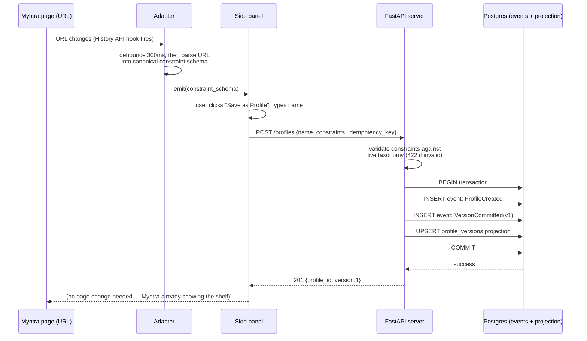
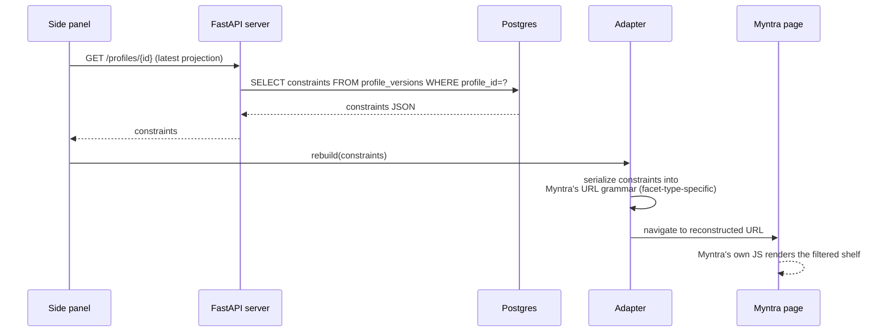
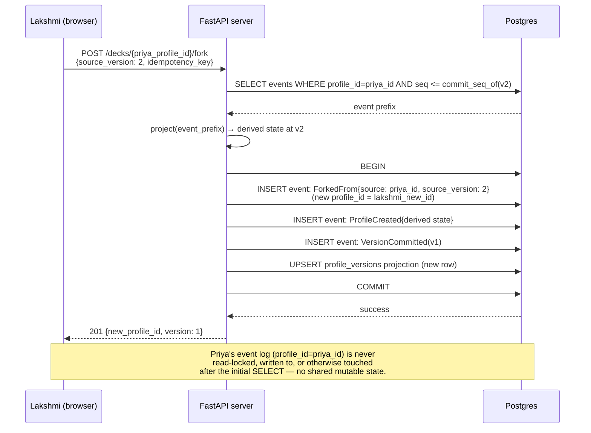

# 10 — End-to-end pipelines: every sub-system cooperating

This document traces four complete user actions through every layer, showing exactly which sub-system (documented in files 01–06) is responsible for which step, and where the technical guarantees from those documents (idempotency, atomicity, canonical serialization) are actually being exercised.

---

## Pipeline 1 — Save a new profile



**Where each earlier document's guarantee is exercised here**: the Adapter's canonical serialization (`01`) ensures the constraint object saved is stable regardless of facet order; the atomic transaction (`02`) ensures the two events and the projection update either all succeed or all roll back together; the idempotency key (`08`) protects against a dropped response causing a duplicate profile creation on client retry.

---

## Pipeline 2 — Reload a profile



**Note the read path here never touches the event log directly** — it reads the `profile_versions` projection, which is the entire point of maintaining a read model separate from the write model (`02`, `07`): fast reads without replaying history on every single load.

---

## Pipeline 3 — Modify an active profile, get a drift-informed 3-way save, commit a new version

```mermaid
sequenceDiagram
    participant Myn as Myntra page
    participant Ad as Adapter
    participant SP as Side panel
    participant API as FastAPI server
    participant Drift as Drift engine
    participant DB as Postgres

    Myn->>Ad: URL changes (brand: Libas → Aurelia)
    Ad->>SP: emit(new constraint schema)
    SP->>SP: compare to active profile's saved constraints<br/>→ mismatch → show "Unsaved changes"
    SP->>SP: user clicks Save
    SP->>API: GET /profiles/{id}/drift?live_state=...
    API->>Drift: compute D(saved, live)
    Drift->>Drift: δ_brand=1.0 × w=0.12<br/>all other fields δ=0<br/>D = 0.12
    Drift-->>API: {drift_score: 0.12, recommended: "new_version",<br/>reason: "brand changed, category unchanged",<br/>field_contributions: {...}}
    API-->>SP: drift result
    SP->>SP: show 3-way modal,<br/>"New Version" pre-selected, reason displayed
    SP->>SP: user confirms
    SP->>API: POST /profiles/{id}/commit<br/>{expected_seq, mode:"new_version", idempotency_key}
    API->>DB: check expected_seq matches current seq
    alt seq matches
        API->>DB: BEGIN; INSERT FilterChanged; INSERT VersionCommitted(v2);<br/>UPDATE projection; COMMIT
        DB-->>API: success
        API-->>SP: 200 {new_version: 2}
    else seq stale (concurrent write happened)
        API-->>SP: 409 Conflict
        SP->>API: refetch current state, recompute drift, re-prompt
    end
```

This pipeline is the one that exercises the most sub-systems at once: the Adapter's dirty-state detection, the Drift engine's explainable scoring, the optimistic-concurrency check on commit, and the atomic multi-event transaction. If a judge asks "walk me through what happens when I change a filter," this is the diagram to have memorized.

---

## Pipeline 4 — Fork a public deck



The note at the bottom is the important technical claim to be able to state under questioning: **forking is read-only with respect to the source profile.** After the initial event-prefix read, there is no further interaction between the two aggregates — which is exactly what makes fork safe under concurrent forking by many different users at once (each fork is an independent read of the same, unchanging historical prefix, followed by writes into an entirely separate, brand-new aggregate).

---

## Cross-cutting concern: where explainability surfaces at every layer

A useful way to see the system's overall design philosophy is to notice that **every non-deterministic or "black-box-shaped" decision in the pipeline is deliberately made inspectable at the API boundary**, not just in the UI:

| Sub-system | The "why" is exposed as | Consumed by |
|---|---|---|
| Drift engine | `field_contributions` in the `/drift` response | Side panel renders "brand changed (0.12), category unchanged" |
| Fuzzy compiler | `provenance` tag (`ai_proposed` / `lexicon_matched` / `user_set`) on each constraint field | Side panel lets user see/edit which filters came from AI |
| Fork | `forked_from_profile_id` / `forked_from_version` on the profile record | UI can show "forked from @priya's v2" |
| Rollback | The full, undeleted event log | Timeline UI can render every past version, not just the current one |

This table is worth having ready for a specific reason: it demonstrates that "scrutability" (the term used in `00-architecture-philosophy.md` and the broader product pitch) is not a UI-layer decoration bolted on top of an opaque backend — **it is a property enforced at the data-model and API-contract level**, which is what makes it credible rather than cosmetic.
